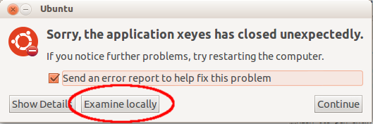
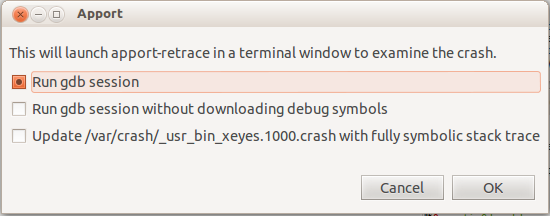
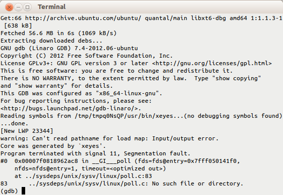

# Ubuntu调试程序崩溃 #

在Ubuntu的官方的Wiki中给出了Ubuntu中的应用程序崩溃的调试方法，其网址为[https://wiki.ubuntu.com/DebuggingProgramCrash](https://wiki.ubuntu.com/DebuggingProgramCrash)。这里简单翻译一下该文档，作为今后查阅资料的参考。

[TOC]

### 介绍 ###

这篇文章描述了如何在Ubuntu上安装调试包，让用户可以在手动执行时提供相关信息，这些信息是发现程序错误所需的详细信息。

1. 栈回溯监视工具-Backtrace。
2. 内存检查工具-Valgrind，如果程序崩溃时提示“段错误”或“总线错误”。
3. 系统调用监视工具-Strace。

### 使用自动生成调试崩溃报告回溯程序`apport-retrace` ###

如果你想要调试打包的Ubuntu软件的崩溃，`Apport`通常会抓住崩溃，在`/var/crash`目录创建一个`.crash`报告，并且报告用户程序已经崩溃。这是使用`apport-retrace`最简单的方式。

`apport-retrace`从自动生成调试崩溃报告中重新生成栈回溯，实际是从包含的核心转储中来重新构建栈回溯，或者创建启动gdb的终端窗口，这个环境中已经带有调试符号，并且通过核心转储已经重建了崩溃时的场景。为此，它需要找出必要的软件包集合和它们附带的调试符号包，这样重建的栈回溯就有符号可看，对于开发者修复问题也更加有用。

`apport-retrace`有两个模式：默认情况下它会基于系统中当前安装的软件包重新生成栈回溯，即它会假设这个报告所需的所有必要的调试符号已经安装（参考下一段了解更详细信息）。当指定了`-S`选项时，它会创建一个临时的“沙箱”，在其中下载和安装所有必须的软件包，调试符号。它不会对你的系统做任何修改，也不需要任何特殊的权限。

请参考[apport-retrace手册]()获取详细信息，以及运行程序的例子。

你也可以从`Apport`崩溃通知中直接调用，点击`Examine locally`按钮就可以实现。



点击后，程序会收集一些软件包的信息，然后询问你想要在什么模式下运行`apport-retrace`:



通常保持第一个选项即可，这会在沙箱中启动中断并进入gdb。



如果你不想交互式的gdb会话，但是仅仅想要使用完整的符号栈回溯更新`.crash`中已有的崩溃信息，那么就可以选择第三项。

### 手动安装调试符号 ###

如果想要调试Ubuntu提供应用程序的崩溃，或者你自己开发的程序，以及第三方提供的程序，或者需要特定库的调试符号，安装相关的调试符号包非常有帮助。

** 内建调试符号的软件包（*-dbg）**

对于很多软件包来说（当然并非所有），我们可以在软件包名称后简单添加`-dbg`后缀来安装对应的调试版本，例如：

```
sudo apt-get intall xserver-xorg-core-dbg
```

** 非内建调试符号包（*-dbgsym）**

对于没有内建在程序中的调试符号，我们就必须添加额外的符号库了。但是请注意，不要即安装内建调试符号的程序，同时又安装对应的调试符号包，这很容易出现问题。软件包管理器无法校验这个重叠的符号，并且阻止它们重复安装。例如同时安装如下两个信息：

```
libprotobuf-c1-dbg
libprotobuf-c1-dbgsym
```

如下是如何安装调试符号包库的步骤：

1. 在命令行终端执行如下的命令，创建`/etc/apt/sources.list.d/ddebs.list`，它是符号源。

    ```
    echo "deb http://ddebs.ubuntu.com $(lsb_release -cs) main restricted universe multiverse" | sudo tee -a /etc/apt/sources.list.d/ddebs.list
    ```

2. 对于稳定发布版本（并非开发，alphas或betas）要在1中的文件中添加额外的两行，可以使用如下的命令来添加：

    ```
    echo -e "deb http://ddebs.ubuntu.com $(lsb_release -cs)-updates main restricted universe multiverse\ndeb http://ddebs.ubuntu.com $(lsb_release -cs)-proposed main restricted universe multiverse" | sudo tee -a /etc/apt/sources.list.d/ddebs.list
    ```

	如果使用新立得软件包管理器也需要添加上述的两行。

3. 在`System>Administration`菜单中选择`Synaptic`。
4. 通过`Settings`菜单选择`Software Sources`或`Repositories`，选择`Third-Party Software`标签页。
5. 点击`Add`按钮，一条一条输入上面的`deb ...`行，点击`Add Source`按钮（你必须一次添加这些行）。
6. 导入调试符号档案文件的签名密钥，在`Ubuntu 18.04`和之后系统上：

    ```
    sudo apt install ubuntu-dbgsym-keyring
    ```

    在早一些的Ubuntu系统上：

    ```
    sudo apt-key adv --keyserver keyserver.ubuntu.com --recv-keys F2EDC64DC5AEE1F6B9C621F0C8CAB6595FDFF622
    ```

7. 然后运行：

    ```
    sudo apt-get update
    ```

    更新你的软件包列表，或如果使用新立得软件包管理器则点击`Reload`按钮。

8. 调试符号包都有`-dbgsym`后缀，所以要安装`yelp`的调试符号包则需要首先运行如下命令：

	```
    apt-cache policy yelp
    ```

	这条命令显示当前安装的程序的版本号（在例子中使用`2.22.1-0ubuntu2.8.04.1`）。注意：yelp（在`System`菜单的`Help and Support`中它是软件包名字）仅仅是一个例子，在你自己使用时则需要用你想要的包名字代替它。

9. 安装调试符号，执行如下命令：

    ```
    sudo apt-get install yelp-dbgsym=2.22.1-0ubuntu2.8.04.1
    ```

    你也可以使用新立得软件包管理器搜索`yelp-dbgsym`，然后安装它。

** 从PPA安装调试符号包 **

如果你想要调试PPA软件包，不用怕！你可以从PPA上为这些软件安装`-dbgsym`调试符号包。在符号包源中通要安装如下的一行：

```
deb http://ppa.launchpad.net/TEAM/PPA/ubuntu RELEASE main
```

在最后简单增加`main/debug`，如下：

```
deb http://ppa.launchpad.net/TEAM/PPA/ubuntu RELEASE main main/debug
```

然后执行`apt update`和`apt install`来安装你想要的`-dbgsym`调试符号包。

** 手动查找所需调试符号 **

上述的过程智慧为yelp安装调试符号包。对于很多软件包，他们在不同的软件包之间共享库。因此，为了获取可读的/更详细的站回溯，或者执行其他的调试任务，你必须查找这些共享库的调试符号。例如，如果你已经将gdb挂到一个应用程序，并且得到如下的输出信息：

```
Reading symbols from /usr/lib/x86_64-linux-gnu/libffi.so.6...(no debugging symbols found)...done.
Loaded symbols for /usr/lib/x86_64-linux-gnu/libffi.so.6
```

这意味着相关的调试符号没有安装。但是，这对于它自己来说没有足够信息去了解需要那个包的调试符号。因此，你可以去[http://packages.ubuntu.com/](http://packages.ubuntu.com/)，将如下的关键字粘贴到`Search the contents of packages`:

```
x86_64-linux-gnu/libffi.so.6
```

从下拉框中选择适当的系统分发版本，然后点搜索。搜索结果会发现它所属软件包是`libffi6`。在新立得软件包管理中

** 自动安装所有的调试符号 **

这个过程会安装所有的调试符号，相反你可能仅仅需要一个或只对一个软件的符号感兴趣。你可以下载脚本[list-symbols-packages-v2.1.sh](https://wiki.ubuntu.com/DebuggingProgramCrash?action=AttachFile&do=get&target=list-symbols-packages-v2.sh)来解析所有的依赖。将调试器挂到已经运行的进程或许需要提升权限，即使你是进程的拥有者。如下的调用会打印出要安装文件的列表：

```
sudo bash ./list-symbols-packages-v2.sh -p $(pidof yelp)
```

自动安装他们，可以使用脚本的输出来自动调用apt。调用脚本时使用`-t`参数，输出简要的数据结果，不需要软件包的详细描述和错误信息。

```
sudo bash ./list-symbols-packages-v2.sh -t -p $(pidof yelp) 2>/dev/null | xargs -d $'\n' sudo apt-get install
```

> 版本2的脚本可以兼容更新的GDB（它不再在启动时默认加载所有的库）。版本2当前只对正在运行的二进制有效，即使用`-p $(pidof <whatever>`参数。老版本的脚本也可用。

### 卸载所有的调试符号 ###

如果想要卸载所有的调试符号包和ddebs库，可以使用如下的命令：

```
sudo apt-get remove \.*-dbgsym \.*-dbg
sudo rm /etc/apt/sources.list.d/ddebs.list
sudo apt-get update
```

### Xorg服务器 ###

根据环境，X服务器会跟踪它自己的崩溃，将栈回溯信息转储到`/var/log/Xorg.0.log`。但是，栈回溯可以被信号处理函数本身修改。如果apport没有捕获崩溃，增加如下的内容到`/etc/X11/xorg.conf`文件中。

```
Section "ServerFlags"
        Option "NoTrapSignals" "true"
EndSection
```

参考[X/Debugging](https://wiki.ubuntu.com/X/Debugging)了解如何调试Xorg服务的崩溃。

### BugSquad相关信息 ###

如果你正尝试用`apport-retrace`来分析一个bug，如果这个bug不是出现在你正在使用的Ubuntu发布版本上，最好的方式就是虚拟化它重现的环境。但是，如果无法虚拟环境，你可以执行如下的例子。假如你正运行`Trusty`系统，但是崩溃发生在`Precise`上。

1. 使用如下的命令可以创建一个小型的`Precise`系统：

	```
    sudo mkdir -p /chroots/precise
    sudo debootstrap precise /chroots/precise/
    ```

2. 构建了系统之后，转到这个微型的`Precise`系统：

	```
    sudo chroot /chroots/precise
    ```

3. 编辑`/etc/apt/sources/list`，添加所有你需要的仓库地址，包括ddeb仓库。
4. 在终端中执行如下的命令。

	```
    sudo apt-get update;
    sudo apt-get install gdb apport
    ```

5. 正常使用`apport-retrace`即可。

更多关于处理bug报告`Apport`可以参考[Bugs/ApportRetraces](https://wiki.ubuntu.com/Bugs/ApportRetraces)。

By Andy@2018-12-06 20:23:48
