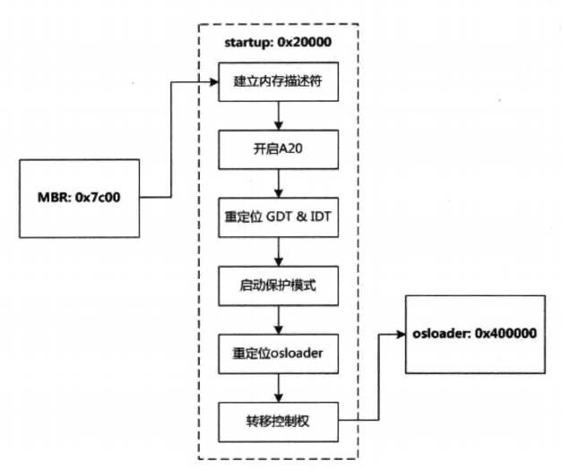
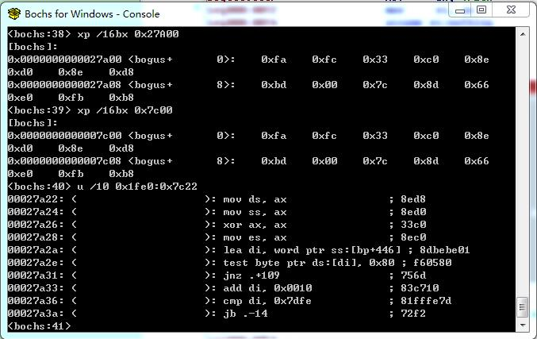
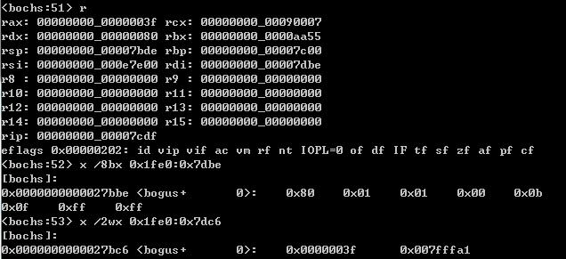
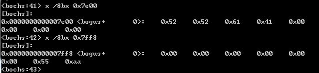

系统加电自检后会将引导驱动器第一个扇区加载到0x7C00地址处，并且跳转到0x7C00开始执行，这就进入MBR（Main Boot Record）了。这里先给出一个Windows系统启动的早期过程的简图，图摘自《Windows内核设计思想》。

<div align="center">

</div>

MBR在安装操作系统时已经被填充了，包含代码和数据两部分；前半部分是启动引导代码，后半部分是一张磁盘分区表，记录了每个分区在磁盘上的位置，大小以及分区类型。在MBR的512字节中，446Bytes可用于代码存储，64Bytes用于磁盘分区（4个分区表，每项使用16Bytes），最后有2Byte的MBR签名，即固定的55 AA。在ReactOS系统（博主编译的版本中）中，其实这个MBR就是ISO安装文件中loader目录下的dosmbr.bin文件的内容。下面给出MBR的代码部分的汇编代码（Copy IDA反汇编，结合Bochs调试中的反汇编修改），这个代码在ReactOS中其实是对应源代码，以汇编代码给出。所在文件是`*\reactos\boot\freeldr\bootsect\dosmbr.asm`。

<!-- more -->

```
seg000:0000 ; Segment type: Pure code
seg000:0000 seg000          segment byte public 'CODE' use16
seg000:0000                 assume cs:seg000
seg000:0000                 assume es:nothing, ss:nothing, ds:nothing, fs:nothing, gs:nothing
seg000:0000                 cli
seg000:0001                 cld
seg000:0002                 xor     ax, ax
seg000:0004                 mov     ss, ax
seg000:0006                 mov     ds, ax			; 数据段，栈段都清空掉
seg000:0008                 mov     bp, 7C00h		; 设置栈底
seg000:000B                 lea     sp, word ptr ss:[bp-20h]	; 栈顶设置为 7BE0，堆栈大小为0x20
seg000:000E                 sti
seg000:000F                 mov     ax, 1FE0h		;
seg000:0012                 mov     es, ax
seg000:0014                 mov     si, bp
seg000:0016                 mov     di, bp
seg000:0018                 mov     cx, 100h
seg000:001B                 rep movsw word ptr es:[di], word ptr ds:[si]
seg000:001D                 jmp     far ptr 1FE0h:7C22h
                            ; rep movw将0x7C00处的512字节拷贝到1FE0:7C00内存处（即物理地址0x27A00处）
                            ; 跳转到1FE0h:7C22h地址处继续执行，其实就是接着向下执行，只是将代码做了个浮动
seg000:0022 ; ---------------------------------------------------------------------------
seg000:0022                 mov     ds, ax
seg000:0024                 mov     ss, ax			; SS/DS设置为 0x1EF0，同代码段寄存器CS
seg000:0026                 xor     ax, ax
seg000:0028                 mov     es, ax
seg000:002A                 lea     di, word ptr ss:[bp+1BEh]	; 1BEh=446，分区表偏移
seg000:002E loc_2E:
seg000:002E                 test    byte ptr [di], 80h ; 校验磁盘分区，是否激活状态 80h激活 / 00未激活
seg000:0031                 jnz     .+109			; loc_A0
seg000:0033                 add     di, 10h			; 下一个分区
seg000:0036                 cmp     di, 7DFEh		; 是否到最后一个分区，
seg000:003A                 jb      .-14			; loc_2E
seg000:003C                 call    .+199			; sub_106 四个分区都不是活动分区，则输出错误信息
seg000:003C ; ---------------------------------------------------------------------------
seg000:003F NoActivePartiti db 'No active partition found',0	; 没有活动分区的错误信息
seg000:0059 ; ---------------------------------------------------------------------------
seg000:0059 loc_59:                                 ; 进入死循环
seg000:0059                 jmp     short loc_59
seg000:005B ; ---------------------------------------------------------------------------
seg000:005B loc_5B:                                 ; 输出读取驱动时错误
seg000:005B                 call    sub_106
seg000:005B ; ---------------------------------------------------------------------------
seg000:005E aReadErrorWhile db 'Read error while reading drive',0
seg000:007D ; ---------------------------------------------------------------------------
seg000:007D                 jmp     short loc_59
seg000:007F ; ---------------------------------------------------------------------------
seg000:007F loc_7F:                                 ; 输出分区签名错误信息
seg000:007F                 call    sub_106
seg000:007F ; ---------------------------------------------------------------------------
seg000:0082 aPartitionSigna db 'Partition signature != 55AA',0
seg000:009E ; ---------------------------------------------------------------------------
seg000:009E                 jmp     short loc_59
seg000:00A0 ; ---------------------------------------------------------------------------
seg000:00A0 loc_A0:									; 找到活动目录
seg000:00A0                 call    .+19			; sub_B6 读取磁盘
seg000:00A3                 jb      .-74			; loc_5B	; 读取磁盘错误，则显示错误信息
seg000:00A5                 cmp     word ptr es:7DFEh, 0AA55h	; 校验读入的最初一个扇区是否有MBR标识
seg000:00AF                 jnz     short loc_7F
seg000:00B1                 jmp     far ptr 0:7C00h
seg000:00B6
seg000:00B6 ; =============== S U B R O U T I N E =======================================
seg000:00B6
seg000:00B6 sub_B6          proc near               ;
seg000:00B6                 mov     bx, 55AAh
seg000:00B9                 mov     ah, 41h     	; AH=41H为校验是否支持INT 13H扩展功能
seg000:00BB                 int     13h             ; DISK - Check for INT 13h Extensions
seg000:00BB                                         ; BX = 55AAh, DL = drive number
seg000:00BB                                         ; Return: CF set if not supported
seg000:00BB                                         ; AH = extensions version
seg000:00BB                                         ; BX = AA55h
seg000:00BB                                         ; CX = Interface support bit map 支持接口
seg000:00BB                                         ;	1 - Device Access using the packet structure
seg000:00BB                                         ; 	2 - Drive Locking and Ejecting
seg000:00BB                                         ; 	4 - Enhanced Disk Drive Support (EDD)
seg000:00BD                 jb      .+50			; short loc_F1 cf没有置位，说明支持，返回值BX为AA55
seg000:00BF                 cmp     bx, 0AA55h
seg000:00C3                 jnz     .+44			; short loc_F1
seg000:00C5                 test    cl, 1
seg000:00C8                 jz      .+39			; short loc_F1
seg000:00CA                 jmp     .+16			; short loc_DC
seg000:00CA ; ---------------------------------------------------------------------------
seg000:00CA ; 定义数据结构，用于磁盘读取 DAP（Disk Address Packet）即磁盘地址包，是磁盘读取参数
seg000:00CC                 db  10h			; DAP的大小，16字节
seg000:00CD                 db  00			; 没有使用
seg000:00CE                 dw  0004h		; 要读取的扇区数
seg000:00D0                 dw  7C00h		; offset	segment:offset设置了要存入内存的地址
seg000:00D2                 dw  0000h		; segment
seg000:00D4                 dd  00h, 00h, 00h, 00h	; 读取扇区起始号，大小超过4G了，要用8字节
seg000:00D8                 dd  00h, 00h, 00h, 00h
seg000:00DC ; ---------------------------------------------------------------------------
seg000:00DC loc_DC:         ; ds:di 0x1fe0:0x7dbe，即分区表第一项起始地址，已占用分区数
seg000:00DC                 mov     ax, [di+8]
seg000:00DF loc_DF:
seg000:00DF                 mov     ds:7CD4h, ax ; ds:7CD4h为DAP包中读取扇区号字段起始地址
seg000:00E2 loc_E2:
seg000:00E2 ; DISK - IBM/MS Extension - EXTENDED READ (DL - drive, DS:SI - disk address packet)
seg000:00E2                 mov     ax, [di+0Ah]    ; di=0x7dbe，为活动扇区，分区前已占用扇区
seg000:00E5                 mov     ds:7CD6h, ax    ; LBA读取起始扇区号
seg000:00E8                 mov     ax, 4200h		; 42H 扩展读功能
seg000:00EB                 mov     si, 7CCCh
seg000:00EE                 int     13h
seg000:00F0                 retn
seg000:00F1 ; ---------------------------------------------------------------------------
seg000:00F1	; INT 13 功能02H 读取扇区，不支持扩展时使用基本的读取扇区功能
seg000:00F1 loc_F1:
seg000:00F1                 mov     ax, 204h    ; AL=4 读取四个扇区
seg000:00F4                 mov     bx, 7C00h   ; ES:BX 为内存扇区的存放起始地址
seg000:00F7                 mov     cx, [di+2]  ; CH=磁道号 CL=扇区号
seg000:00FA loc_FA:
seg000:00FA                 mov     dh, [di+1]  ; DH=磁头 DL=驱动器
seg000:00FD                 int     13h             ; DISK - READ SECTORS INTO MEMORY
seg000:00FD                                         ; AL=num of sectors to read,CH=track, CL=sector
seg000:00FD                                         ; DH=head, DL=drive, ES:BX->buffer to fill
seg000:00FD                                         ; Return:
seg000:00FD                                         ;   CF set on error,
seg000:00FD                                         ;   AH=status, AL=number of sectors read
seg000:00FF                 retn
seg000:00FF sub_B6          endp
seg000:00FF
seg000:0100 ; ---------------------------------------------------------------------------
seg000:0100 ; START OF FUNCTION CHUNK FOR sub_106
seg000:0100 ; sub_106函数的一部分代码，调用BIOS INT 10H，在屏幕上输出字符
seg000:0100     loc_100:
seg000:0100                 xor     bx, bx
seg000:0102                 mov     ah, 0Eh
seg000:0104                 int     10h             ; - VIDEO - WRITE CHARACTER AND ADVANCE CURSOR
seg000:0104 ; END OF FUNCTION CHUNK FOR sub_106     ; AL=character, BH=display page (alpha modes)
seg000:0104                                         ; BL=foreground color(graphics modes)
seg000:0106 ; =============== S U B R O U T I N E =======================================
seg000:0106 ; FUNCTION CHUNK AT seg000:0100 SIZE 00000006 BYTES
seg000:0106 ; 用于在屏幕上输出字符串，其中字符串地址即返回地址，通过call压入栈中，通过栈传入
seg000:0106 sub_106         proc near
seg000:0106                 pop     si				; 获取要输出字符串地址
seg000:0107                 lodsb
seg000:0108    loc_108:
seg000:0108                 push    si
seg000:0109                 cmp     al, 0
seg000:010B                 jnz     short loc_100
seg000:010D                 retn
```

> 注：汇编代码中形如XXh的为16进制数字，XX为10进制数，loc_*/sub_*中*为16进制数

首先将段寄存器进行初始化设置，然后将将0x7C00处的512字节拷贝到1FE0:7C00内存处（即物理地址0x27A00处），跳转到拷贝的地址继续执行代码。拷贝的内存调试查看如下图所示。

<div align="center">

</div>

从四个分区数据中寻找活动分区，分区表项的定义数据结构如下所示，有起始与结束的磁道号，扇区号，柱面号等。分区表项的结构如下代码段所示，图3给出了文章中调试的ReactOS的活动分区的内容。

```
; MBR中每一条分区信息为一个结构体，格式如下代码块所示（数据为调试出的真实数据）。
; Partion Start
	db  80h           ; 分区状态（80h=激活，00=未激活）
	db  01h           ; 起始磁道号
	db  01h           ; 起始扇区号
	db  00h           ; 起始柱面号
	db  0Bh           ; 分区类型（07=HTFS，0B=FAT32）
	db  0Fh           ; 结束磁道号
	db  FFh           ; 结束扇区号
	db  FFh           ; 结束柱面号
	dd  0000003Fh     ; 分区前已经占用扇区数
	dd  007FFFA1h     ; 分区所占用扇区总数
; Partion End
```

<div align="center">

</div>

程序找到活动分区后，根据分区的信息读取活动扇区的前四个扇区，将磁盘内容到内存0x0000:0x7C00处。在读取磁盘时，判断是否支持INT 13H扩展功能；如果支持扩展则直接使用扩展功能中的42H号读磁盘功能读取磁盘，使用INT 13H扩展读取磁盘时，需要用到读取参数结构体DAP，其结构如下代码段所示；否则使用INT 13H传统的读取磁盘的方式。由于前面将物理内存0x7C00处的数据移动了另外的地方，读取磁盘时直接将磁盘中的四页数据（512B*4）读到了0x7C00地址处。读取完成后，要对第一个扇区的最后两个字节做MBR检验，通过校验确定是引导扇区则跳转到0x0000:0x7C00地址处执行。

BIOS功能的INT 13H调用，42H号扩展功能从磁盘读取n个扇区到内存中，入口参数为AH=0x42，DL=磁盘号（0x80为硬盘），DS:SI=DAP，这个功能可以实现一次读取多个磁盘扇区。

```
// 磁盘读取的DAP（Disk Address Packet）即磁盘地址包，是磁盘读取设置的参数
typedef struct _DAP
{
	BYTE bySize;		// 结构体大小
    BYTE byUnUsed;
    WORD wReadSec;		// 读取的扇区数
    WORD wOffSet;		// 偏移地址，和下一个字段组成segment:offset 写入的内存地址
    WORD wSegment;		// 段地址
    QWORD qwStartSecNo;	// 开始读取的扇区编号（第一个扇区的编号为0）
}DAP, *PDAT;
```

> 这里MBR读取的磁盘扇区是活动分区的第一个扇区，即0号扇区，并不是整个磁盘的0号扇区。由于安装的ReactOS系统使用FAT32文件格式，这个扇区保存的是FAT32引导扇区（FAT32 Boot Sector）。

这里加载的内容即是DBR（Dos Boot Recort），或者也称作PBR（Partion Boot Record），分区引导记录。看一下加载到0x7C00处的数据，由于安装ReactOS时使用默认的FAT32文件格式进行的磁盘格式化，所以加载内核程序使用的就是ISO安装包中loader目录下的fat32.bin文件，它对应的源码位于`reactos\boot\freeldr\fat32.asm`文件中，如下给出该文件源代码，在代码中做注释。但是MBR加载的内容并非整个fat32.bin文件，而只有它的前半部分。

> 注意这个fat32.asm文件中有两个部分的内容，前一个扇区是FAT32的引导扇区的代码，位于引导磁盘0号磁头1号柱面1号扇区，剩下的一个部分并不是紧邻它的下一个扇区，而是14号扇区。即fat32.bin在安装操作系统时被劈成两半，一半为引导扇区，一半作为引导扇区扩展，位于14号扇区中。

加载到0x7C00处的第一个扇区内容即DBR（Dos Boot Record Dos引导记录），它位于柱面0，磁头1，扇区1，即逻辑扇区0。DBR分为两部分：Dos引导程序和BPB（BIOS参数块，BIOS Parameters Block）。DOS引导程序完成DOS系统文件定位与装载，此处是加载扩展代码；BPB位于DBR偏移0BH处，共79个字节，记录了有关文件系统的重要信息，ReactOS用的是FAT32，此处记录了FAT32文件系统相关的重要信息，具体内容可以参考下面的汇编代码中此块的内容注释。

```
; FAT32.ASM
; FAT32 Boot Sector
; Copyright (c) 1998, 2000, 2001, 2002 Brian Palmer

org 7c00h			; 基地址设置为0x7C00

segment .text

bits 16
start:
        jmp short main
        nop

OEMName             db 'FrLdr1.0'	; MSWIN4.1
; BPB，即Bios Parameter Block 0x0B处开始
BytesPerSector      dw 512			; 每个扇区大小 0x0200   512字节
SectsPerCluster     db 0			; 每簇的扇区数 0x8
ReservedSectors     dw 32			; 保留扇区数   0x0020	32个
NumberOfFats        db 2			; FAT表的数量 0x2
MaxRootEntries      dw 0            ; Always zero for FAT32 volumes  0x0000
TotalSectors        dw 0            ; Always zero for FAT32 volumes  0x0000
MediaDescriptor     db 0f8h			; 0xF8	描述介质
SectorsPerFat       dw 0            ; Always zero for FAT32 volumes  0x0000
SectorsPerTrack     dw 0			; 0x003F	扇区数/磁道
NumberOfHeads       dw 0			; 磁头数  0x0010
HiddenSectors       dd 0			; 隐藏扇区数 0x0000003F
TotalSectorsBig     dd 0			; 0x007FFFA1  总扇区数

; FAT32 Inserted Info
SectorsPerFatBig    dd  0			; 0x00001FF0  每FAT表占用的扇区数
ExtendedFlags       dw  0			; 0x0000 标记
FSVersion           dw  0			; 0x0000 版本
RootDirStartCluster dd  0			; 0x00000002	根目录首簇号，注意不是起始扇区
FSInfoSector        dw  0			; 0x0001 文件系统扇区号
BackupBootSector    dw  6			; 0x0006 DBR备份扇区号
Reserved1           times 12 db 0	; 保留，全都为0
; End FAT32 Inserted Info

BootDrive           db 0			; 保存预设的引导驱动器 0x80 BIOS驱动器号
Reserved            db 0			; 0x00  保留未用
ExtendBootSig       db 29h			; 0x29  扩展引导标记
SerialNumber        dd 00000000h	; 0x3f273bf4  卷序列号
VolumeLabel         db 'NO NAME    '; Size 11, 'NO NAME    ‘ 卷标
FileSystem          db 'FAT32   '   ; 文件系统类型 'FAT32   '

main:
        xor ax,ax               ; Setup segment registers 设置段寄存器，由于被加载到0x7C00地址处
        mov ds,ax               ; Make DS correct 段寄存器都要设置为 0，就与代码预设相同了
        mov es,ax               ; Make ES correct
        mov ss,ax               ; Make SS correct
        mov bp,7c00h
        mov sp,7c00h            ; Setup a stack

        cmp BYTE [BYTE bp+BootDrive],BYTE 0xff  ; If they have specified a boot drive then use it
        jne CheckSectorsPerFat

        mov [BYTE bp+BootDrive],dl              ; 从MBR跳转过来时DL保存的就是引导驱动器号

CheckSectorsPerFat:
        cmp WORD [BYTE bp+SectorsPerFat],byte 0x00  ; 检查SectorsPerFat的过时的16位值，如果非0，则错误
        jnz CheckFailed                             ; If it is non-zero then exit with an error

CheckTotalSectors:                                  ; 检查TotalSectors & MaxRootEntries 16位值
        cmp DWORD [BYTE bp+MaxRootEntries],byte 0x00; 在MaxRootEntries偏移处用DWORD大小数据与0对比
        jnz CheckFailed                             ; If it is non-zero then exit with an error

CheckFileSystemVersion:
        cmp WORD [BYTE bp+FSVersion],byte 0x00      ; 检查文件系统版本 WORD，非0则认为有问题
        jna GetDriveParameters                      ; It is zero, so continue

CheckFailed:
        jmp PrintFileSystemError                    ; 输出错误信息

GetDriveParameters:
        mov  ax,0800h
        mov  dl,[BYTE bp+BootDrive]                 ; dl寄存器保存引导驱动器
        int  13h                                    ; 使用BIOS INT 13H功能获取驱动参数
        jnc  CalcDriveSize                          ; If the call succeeded then calculate the drive size

        ; 获取失败则将CHS设置为可访问的最大地址大小
        mov  cx,0ffffh
        mov  dh,cl

CalcDriveSize:
        ; 获取成功则计算驱动器大小
        mov  bl,ch          ; Put the low 8-bits of the cylinder count into BL
        mov  bh,cl          ; Put the high 2-bits in BH   CX中保存了柱面数，但是它是逆向存储的，需要处理
        shr  bh,6           ; Shift them into position, now BX contains the cylinder count
        and  cl,3fh         ; Mask off cylinder bits from sector count
        ; CL now contains sectors per track and DH contains head count CL保存了每个磁道的扇区数，DH为磁头数
        movzx eax,dh        ; Move the heads into EAX		// 将获取的数字进行扩展
        movzx ebx,bx        ; Move the cylinders into EBX
        movzx ecx,cl        ; Move the sectors per track into ECX
        inc   eax           ; Make it one based because the bios returns it zero based 加1，变为从1开始
        inc   ebx           ; Make the cylinder count one based also 柱面数，从0开始，变为从1开始
        mul   ecx           ; Multiply heads with the sectors per track, result in edx:eax
        mul   ebx           ; Multiply the cylinders with (heads * sectors) [stored in edx:eax already]
                            ; 磁头*柱面(每面)*扇区（每磁道） 总容量
        ; We now have the total number of sectors as reported
        ; by the bios in eax, so store it in our variable
        mov   [BiosCHSDriveSize],eax	;将结果保存到变量中	4G磁盘，计算出的值为0x7FF58A

LoadExtraBootCode:
        ; First we have to load our extra boot code at
        ; sector 14 into memory at [0000:7e00h]	将位于14扇区的额外的引导代码加载到内存0000:7E00h
        mov  eax,0eh
        add  eax,DWORD [BYTE bp+HiddenSectors]  ; Add the number of hidden sectors 加上隐藏扇区数
        mov  cx,1								; 后半部分位于14号扇区（隐藏扇区3F个，起始号为0E+3F）
        xor  bx,bx
        mov  es,bx                              ; Read sector to [0000:7e00h]
        mov  bx,7e00h
        call ReadSectors                        ; 调用扇区读入函数
        jmp  StartSearch

; Reads logical sectors into [ES:BX] 将逻辑扇区读入[ES:BX]
; EAX has logical sector number to read EAX为逻辑扇区号
; CX has number of sectors to read CX为要读入的扇区数
ReadSectors:
        push es
        cmp  eax,DWORD [BiosCHSDriveSize]       ; BiosCHSDriveSize保存了扇区总数，检查是否超过限制
        jae  ReadSectorsLBA                     ; 支持LBA例程，则使用LBA方式读取磁盘
                                                ; 之所以尽可能使用LBA方式读取，原因是LBA读磁盘进行了优化
                                                ; 它可以实现一次读取多个扇区
        pushad                                  ; 保存要读取的逻辑扇区号和扇区数
CheckInt13hExtensions:                          ; 检查是否支持 INT 13H扩展
        mov  ah,0x41                            ; AH = 41h
        mov  bx,0x55aa                          ; BX = 55AAh
        mov  dl,[BYTE bp+BootDrive]             ; DL = drive (80h-FFh)
        int  13h                                ; IBM/MS INT 13 Extensions - INSTALLATION CHECK
        jc   ReadSectorsCHS                     ; CF set on error (extensions not supported)
        cmp  bx,0xaa55                          ; BX = AA55h if installed
        jne  ReadSectorsCHS
        test cl,1                               ; CX = API subset support bitmap
        jz   ReadSectorsCHS                     ; Bit 0, 支持扩展磁盘功能(AH=42h-44h,47h,48h)
        popad                                   ; 恢复扇区数和逻辑扇区号寄存器内容

ReadSectorsLBA:
        pushad                                  ; 保存要读取的逻辑扇区号和扇区数

        cmp  cx,64                              ; LBA只支持最多0x7F个扇区读取，这里限制为64
        jbe  ReadSectorsSetupDiskAddressPacket  ; 如果扇区数小于64，则直接读
        mov  cx,64                              ; 否则将读取扇区数设置为64
ReadSectorsSetupDiskAddressPacket:
        mov  [LBASectorsRead],cx
        push 0h                                 ; 压入32位 0 数据，即一个DWORD
        push 0h
        push eax                                ; 64位逻辑块地址，即要读取的起始逻辑号
        push es                                 ; Put transfer segment on stack
        push bx                                 ; Put transfer offset on stack
        push cx                                 ; cx为要读取的扇区数
        push byte 0x10                          ; 设置DAP数据包结构体的 大小
        mov  si,sp                              ; Setup disk address packet on stack

        mov  dl,[BYTE bp+BootDrive]             ; Drive number
        mov  ah,42h                             ; Int 13h, AH = 42h - Extended Read
        int  13h                                ; Call BIOS
        jc   PrintDiskError                     ; If the read failed then abort

        add  sp,byte 0x10                       ; Remove disk address packet from stack

        popad                                   ; Restore sector count & logical sector number

        push bx
        mov  ebx,DWORD [LBASectorsRead]
        add  eax,ebx                            ; Increment sector to read
        shl  ebx,5
        mov  dx,es
        add  dx,bx                              ; Setup read buffer for next sector
        mov  es,dx
        pop  bx

        sub  cx,[LBASectorsRead]
        jnz  ReadSectorsLBA                     ; Read next sector

        pop es
        ret

LBASectorsRead:
    dd  0	 ; LBA方式读取磁盘，设置一次最多读取64个，如果扇区数大于64，则该变量存储剩余总数

; Reads logical sectors into [ES:BX] 标准的INT 13H 读取磁盘功能
; EAX has logical sector number to read
; CX has number of sectors to read
ReadSectorsCHS:
        popad                                       ; Get logical sector number & sector count off stack
ReadSectorsCHSLoop:
        pushad
        xor   edx,edx
        movzx ecx,WORD [BYTE bp+SectorsPerTrack]
        div   ecx                                   ; Divide logical by SectorsPerTrack
        inc   dl                                    ; Sectors numbering starts at 1 not 0
        mov   cl,dl                                 ; Sector in CL
        mov   edx,eax
        shr   edx,16
        div   WORD [BYTE bp+NumberOfHeads]          ; Divide logical by number of heads
        mov   dh,dl                                 ; Head in DH
        mov   dl,[BYTE bp+BootDrive]                ; Drive number in DL
        mov   ch,al                                 ; Cylinder in CX
        ror   ah,1                                  ; Low 8 bits of cylinder in CH, high 2 bits
        ror   ah,1                                  ;  in CL shifted to bits 6 & 7
        or    cl,ah                                 ; Or with sector number
        mov   ax,0201h
        int   13h    ; DISK - READ SECTORS INTO MEMORY
                     ; AL = number of sectors to read, CH = track, CL = sector
                     ; DH = head, DL = drive, ES:BX -> buffer to fill
                     ; Return: CF set on error, AH=status(see AH=01h), AL=number of sectors read

        jc    PrintDiskError                        ; If the read failed then abort

        popad

        inc   eax                                   ; Increment Sector to Read

        mov   dx,es
        add   dx,byte 20h                           ; Increment read buffer for next sector
        mov   es,dx

        loop  ReadSectorsCHSLoop                    ; Read next sector

        ret

; Displays a disk error message
; And reboots 输出错误信息，并且重新启动
PrintDiskError:
        mov  si,msgDiskError            ; Bad boot disk message
        call PutChars                   ; Display it

        jmp  Reboot

; Displays a file system error message
; And reboots 显示文件系统错误，并且重启
PrintFileSystemError:
        mov  si,msgFileSystemError      ; FreeLdr not found message
        call PutChars                   ; Display it

Reboot:
        mov  si,msgAnyKey               ; Press any key message
        call PutChars                   ; Display it
        xor ax,ax
        int 16h                         ; Wait for a keypress
        int 19h                         ; Reboot

PutChars:	; 输出一串字符，使用BIOS INT 10H功能
        lodsb
        or al,al
        jz short Done
        mov ah,0eh
        mov bx,07h
        int 10h
        jmp short PutChars
Done:
        retn

BiosCHSDriveSize    dd 0   ; 程序运行起来后，本磁盘驱动器（活动扇区）所具有扇区总数

msgDiskError        db 'Disk error',0dh,0ah,0
msgFileSystemError  db 'File system error',0dh,0ah,0
msgAnyKey           db 'Press any key to restart',0dh,0ah,0

        times 509-($-$$) db 0   ; Pad to 509 bytes

BootPartition:
        db 0

BootSignature:
        dw 0aa55h       ; BootSector signature 引导扇区的签名 0xAA55
; End of bootsector
```

FAT32文件系统在DBR的保留扇区（0x20，32个）中安排了一个文件系统信息扇区，用于记录数据区中空闲簇的数量以及下一个空闲簇的簇号，该扇区一般在活动分区（主分区）的一号扇区，紧跟着DBR后的一个扇区中。前面知道fat32.bin被分为两部分，第一部分DBR位于活动分区中的0号扇区，那么紧跟着这一扇区的即FAT32在保留扇区中安排的文件系统扇区，格式如下代码块所示。

```
BootTag            db 'RRaA'          ; 0x000 扩展引导标签 "52 52 61 41"
Reserved           times 480 db 0     ; 0x004 保留未用
FileSystemTag      db 'HHAa'          ; 0x1E4 文件系统信息签名 "72 72 41 61"
IdleCluster        dd                 ; 0x1E8 空闲簇数
NextIdleClusterNo  dd                 ; 0x1EC 下一个空闲簇的簇号
Reserved2          times 14 db 0      ; 0x1F0 保留未用
BootSignature      dw 0aa55h          ; 0x1FE 结束标记
```

其中引导程序代码在FAT32的DBR引导程序占用420字节，没有安排操作系统的分区这段程序没用，DBR结束标志与MBR，EBR结束标记相同，为`55 AA`。在ReactOS中，加载DBR时，一共加载了4个扇区，其中第二个扇区即这个FAT32文件系统安排的文件系统信息扇区，如图给出调试中看到的该扇区的起始与结尾处的字节内容。

<div align="center">

</div>

> 上面注释中多次提到隐藏扇区，其实隐藏扇区就是MBR占据的那部分（MBR只占据隐藏扇区的第一个），在分区前面。
> |隐藏扇区| 保留扇区 | FAT表 | 根目录区 | 数据区 |
  分区前 <-|->分区之后，也就是文件系统的起始部分

这段DBR加载的扩展代码的内容就很容易预测了：从磁盘上找到内核Loader，然后加载到内容中，跳转到Loader继续执行。安装的ReactOS使用FAT32文件系统格式，FAT32的文件格式如下图所示。

<div align="center">

</div>

按照FAT32格式定位FAT表绝对位置可以按照如下的形式进行：

* 从MBR的分区表找到活动分区，加载DBR。
* 从DBR的BPB中得知DBR保留扇区数，FAT表格数（一般为2），FAT表的大小。
* FAT1=分区起始扇区（隐藏扇区数）+ DBR保留扇区数，FAT2 = 分区起始扇区 + DBR保留扇区 + FAT1

定位FAT32文件系统的数据区起始位置按照如下方法计算：

* 从MBR的分区表中得到活动分区，加载DBR。
* 从DBR中的BPB中得到DBR保留扇区数，FAT表数，FAT表的大小。
* 数据区的起始位置=分区起始扇区（隐藏扇区数） + DBR保留扇区 + FAT表大小 * FAT表个数

FAT32表的格式不太复杂，FAT表由FAT表项构成，FAT表项简称FAT项，每个FAT项占用4个字节，用于描述簇的分配状态以及标明文件或目录的下一个簇号。每个FAT项有一个固定编号，标号从0开始。FAT表的前两个项由文件系统保留使用，0号FAT项为介质类型，1号FAT项为文件系统错误标志。分区的数据区中每个簇都会映射到FAT表中的唯一一个FAT项，0号和1号FAT项已经被系统占用，用户的数据从2号FAT项开始记录。所有的簇从 2 开始进行编号。也就是说 2 号簇的起始位置就是数据区的起始位置。如果某个文件有很多个簇，则第一个FAT项记录下一个FAT项的编号（即簇号），文件结束了，则用“0F FF FF FF”表示。分区格式化以后，用户文件以簇为单位存放在数据区中，一个文件至少占用一个簇，簇大小一般为8扇区，所以最小的文件也要占 4K 磁盘空间。FAT的主要作用就是表明分区存储的介质及簇的使用情况。

如果某个簇存在坏扇区，则整个簇会用FAT表项`0x0FFFFFF7`标记坏簇，不再使用。这个坏簇标记记录在它所对应的FAT表项中。由于簇号起始于2号，所以FAT表项的0号表项和1号表项不予任何簇对应，FAT32的0号表项值总为`0xF8FFFF0F`，1号表项可能被用于记录脏标记，以说明文件系统没有被正常卸载或者磁盘表面存在错误，通常情况下值为`0xFFFFFFFF`或`0xFFFFFF0F`。

数据区的内容主要由三部分组成：根目录，子目录和文件内容。在数据区都是以“簇”为单位进行存取，由于0号和1号簇被系统占用，那么最早的用户的数据（即根目录）只能从2号簇开始存储。根目录的定位方式为：根目录 = 分区起始扇区号 + DBR保留扇区数 + (FAT表大小 * 2)。

在FAT32的Boot Sector（DBR）中对文件系统做了校验，然后将引导代码的另一部分（位于引导磁盘14号扇区，并不挨着FAT32引导扇区所在的0号扇区）加载到了内存0x7E00处，内存中则紧挨着引导扇区，拼接成物理文件fat32.bin的形式，下面给出后面加载的另外一部分代码。

首先获取根目录所在的簇号（即2），然后读取簇号2的簇，8个扇区。加载完根目录所在簇后，开始在根目录中搜索要从FAT32格式的文件系统中加载的文件的名称（FreeLdr.sys，即安装完ReactOS系统后系统盘根目录下就有该文件）。

FAT32文件系统中，分区根目录下的文件和目录都放在根目录区中，子目录中的文件和目录放在子目录区中。每32个字节为一个目录项，每个目录项记录着一个目录或文件（也可能是多个目录项记录一个文件或目录）。在FAT32中，目录项分为四类：卷目录项，"."和".."目录项，短文件名目录项，长文件名目录项。

卷标目录项，卷标就是分区的名字，在格式化时指定或随意修改，长度为11字节。"."和".."目录项，"."表示当前目录，".."表示上一层目录，这两个目录项多存在子目录中。短文件名目录项，即文件名的"8.3"格式，此格式支持文件名不超过8字节，扩展名不超过3字节，短文件名目录是中存放在一个目录项中（目录项结构如下所示）。长文件名目录项，解决短文件名格式无法满足现实需求，长文件名其实是将文件名进行分段，分成若干个短文件名进行存储。

```
typedef struct _ShortNameDir
{
	BYTE fileName[8];
    BYTE extName[3];
    BYTE fileAttr;		// 文件属性
    BYTE reserved;		// 保留
    BYTE createTime;	// 创建秒数精确到10ms
    WORD createTime;	// 创建时间包括时、分、秒
    WORD createDate;	// 创建日期，包括年、月、日
    WORD hiClusterNo;	// 文件起始簇号高位
    WORD modifyTime;	// 修改时间包括时、分、秒
    WORD modifyDate;	// 修改日期，包括年、月、日
    WORD loClusterNo;	// 文件起始簇号低位
    DWORD fileSize;		// 文件大小，以字节为单位
}ShortNameDir, *LPShortNameDir;
```

长文件名在分段存储按照如下的原则进行处理：

* 系统取长文件名的前6个字符加上"~1"形成短文件名，其扩展不变
* 如果已存在这个名字的文件，则符号"~"后的数字自动增加
* 如果文件名内存在Windows非法的字符，则以下划线"_"代替
* 长文件名目录项采用倒叙的方式进行记录

```
typedef struct _LongNameDir
{
	BYTE serialNo;		// 序列号
    BYTE firUniChr[10]; // 文件名第1-5个Unicode码字符
    BYTE longNameSig;	// 长文件名目录项属性标志，固定为"0F"
    BYTE reserved;		// 保留
    BYTE chkSum;		// 短文件名校验和
    BYTE secUniChr[12];	// 6-11个UNICODE码字符
    WORD reserved0;		// 始终为0
    DWORD thrUniChr;	// 文件名第12-13个UNICODE码字符
}LongNameDir, *LPLongNameDir;
```

即长文件名目录项组成：短文件名目录项（ShortNameDir）开始，加上若干个长文件名目录项（LongNameDir）。结束目录项的serialNo字段会和0x40（LAST_LONG_ENTRY）进行或操作；其中serialNo字段的最大值也即LAST_LONG_ENTRY，不能再大。

```
; 存储在FAT32卷的 14号扇区 为额外的引导代码
;
; 这里是保持和其他操作系统共存的多引导进行兼容，不能将引导扇区以外的扇区复写。
; 只能使用像14号扇区这么一个地方来存储额外代码
StartSearch:
        ; Now we must get the first cluster of the root directory
        ; 获取根目录的第一个簇
        mov  eax,DWORD [BYTE bp+RootDirStartCluster]	; RootDirStartCluster值为 0x2
        cmp  eax,0ffffff8h      ; 校验是否最后一个簇，一簇8扇区
        jb   ContinueSearch     ; If not continue, if so then we didn't find freeldr.sys
        jmp  PrintFileNotFound
ContinueSearch:
        mov  bx,2000h
        mov  es,bx              ; Read cluster to [2000:0000h] 将搜索到的簇加载到[2000:0000h]
        call ReadCluster        ; 读取一簇数据，8个扇区，注意这里需要定位FAT32的数据区起始扇区号

        ; Now we have to find our way through the root directory to
        ; The FREELDR.SYS file 查找FREELDR.SYS文件
        xor  bx,bx
        mov  bl,[BYTE bp+SectsPerCluster]	; 每簇8个扇区
        shl  bx,4               ; BX = BX * 512 / 32 一个目录项32字节，计算一簇的目录项数
        mov  ax,2000h           ; 簇被加载到 2000:0000
        mov  es,ax
        xor  di,di
        mov  si,filename		; "FREELDR SYS"，注意按照FAT32短文件名形式 11字节文件名
        mov  cx,11
        rep  cmpsb              ; Compare filenames
        jz   FoundFile          ; 找到了，跳转到FoundFile
        dec  bx
        jnz  FindFile			; 如果这一簇还没有搜索完，继续查找文件
        jmp  PrintFileNotFound

FindFile:
        mov  ax,es              ; We didn't find it in the previous dir entry
        add  ax,2               ; So lets move to the next one
        mov  es,ax              ; And search again 将段寄存器加2，即最终物理地址会加32
        xor  di,di
        mov  si,filename
        mov  cx,11
        rep  cmpsb              ; Compare filenames
        jz   FoundFile          ; If same we found it
        dec  bx                 ; Keep searching till we run out of dir entries
        jnz  FindFile           ; Last entry?

        ; 获取下一个根目录簇，直到搜索完根目录的所有簇。即遇到0x0FFFFFF8
        mov  eax,DWORD [BYTE bp+RootDirStartCluster]
        call GetFatEntry		; 查找FAT表中 指定簇（EAX）对应FAT项中的值（下一个簇号）
        mov  [BYTE bp+RootDirStartCluster],eax
        jmp  StartSearch

FoundFile:
        mov  si,msgLoading              ; 显示"Loading FreeLoader..."消息
        call PutChars                   ; Display it

        xor  di,di                      ; ES:DI保存了FreeLdr.sys文件目录项
        xor  dx,dx
        mov  ax,WORD [es:di+14h]        ; 获取起始簇号的高Word
        shl  eax,16
        mov  ax,WORD [es:di+1ah]        ; 起始簇号的低Word

CheckStartCluster:
        cmp  eax,2                      ; 起始簇号必须大于2
        jnb  CheckEndCluster            ; If so then continue
        jmp  PrintFileSystemError       ; If not exit with error
CheckEndCluster:
        cmp  eax,0ffffff8h              ; 校验起始簇号是否带有簇链的结尾标识
        jb   InitializeLoadSegment      ; If not then continue
        jmp  PrintFileSystemError       ; If so exit with error

InitializeLoadSegment:
        mov  bx,0F80h   ; FREELDR_BASE / 16 设置FreeLdr.sys文件加载段基址
        mov  es,bx

LoadFile:
        cmp  eax,0ffffff8h      ; Check to see if this is the last cluster in the chain
        jae  LoadFileDone       ; If so continue, if not then read the next one
        push eax				; EAX保存了要加载的簇号
        xor  bx,bx              ; Load ROSLDR starting at 0000:F800h
        push es
        call ReadCluster		; 加载一簇数据
        pop  es

        xor  bx,bx				; 计算下一个簇加载的内存地址，还是修改段寄存器ES
        mov  bl,[BYTE bp+SectsPerCluster]
        shl  bx,5               ; BX = BX * 512 / 16
        mov  ax,es              ; Increment the load address by
        add  ax,bx              ; The size of a cluster
        mov  es,ax

        pop  eax				; 当前加载的簇号
        push es
        call GetFatEntry        ; Get the next entry
        pop  es

        jmp  LoadFile           ; 如果还有下一簇，则继续加载

LoadFileDone:
        mov  dl,[BYTE bp+BootDrive]     ; Load boot drive into DL
        mov  dh,[BootPartition]         ; Load boot partition into DH

        ; Transfer execution to the bootloader 转到引导加载器程序 FreeLdr.sys
        ;ljmp16 0, FREELDR_BASE  长跳转，跳到FreeLdr.sys
        db 0EAh
        dw 0F800h
        dw 0

; 返回给定簇号对应的FAT项的值，即下一个簇号
; On entry EAX has cluster number EAX保存簇号
; On return EAX has FAT entry for that cluster 返回值中EAX为FAT项
; FAT1 = 起始扇区号 + 保留扇区数 + 隐藏扇区数
; 簇号所在扇区号 = FAT1起始扇区号 + 簇号 * 4 / 512(每扇区字节数)
GetFatEntry:

        shl   eax,2                             ; EAX = EAX * 4 (FAT32项为4字节)
        mov   ecx,eax                           ; Save this for later in ECX
        xor   edx,edx
        movzx ebx,WORD [BYTE bp+BytesPerSector]
        push  ebx
        div   ebx                               ; FAT Sector Number = EAX / BytesPerSector
        movzx ebx,WORD [BYTE bp+ReservedSectors]
        add   eax,ebx                           ; FAT Sector Number += ReservedSectors
        mov   ebx,DWORD [BYTE bp+HiddenSectors]
        add   eax,ebx                           ; FAT Sector Number += HiddenSectors
        pop   ebx
        dec   ebx
        and   ecx,ebx                           ; FAT Offset Within Sector = ECX % BytesPerSector
                                                ; EAX 保存了簇所在逻辑扇区号
                                                ; ECX 保存了FAT项的偏移

                                                ; 现在检查扩展标记，确定哪一个FAT表是活动的，使用活动FAT表
        movzx ebx,WORD [BYTE bp+ExtendedFlags]  ; 扩展标记放入EBX
        and   bx,0x0f                           ; 高8位清空，bl中为活动FAT
        jz    LoadFatSector                     ; If fat is mirrored then skip fat calcs
        cmp   bl,[BYTE bp+NumberOfFats]         ; Compare bl to number of fats
        jb    GetActiveFatOffset
        jmp   PrintFileSystemError              ; If bl is bigger than numfats exit with error
GetActiveFatOffset:
        push  eax                               ; Save logical FAT sector number
        mov   eax,[BYTE bp+SectorsPerFatBig]    ; Get the number of sectors occupied by one fat in eax
        mul   ebx                               ; Multiplied by the active FAT index we have in ebx
        pop   edx                               ; Get logical FAT sector number
        add   eax,edx                           ; Add the current FAT sector offset

LoadFatSector:
        push  ecx

        mov   bx, 9000h                         ; We will load it to [9000:0000h]
        mov   es, bx

        ; EAX保存了逻辑FAT扇区号，检查是否已经加载了这个扇区
        cmp  eax,DWORD [FatSectorInCache]
        je   LoadFatSectorAlreadyLoaded

        mov  DWORD [FatSectorInCache],eax
        xor  bx,bx
        mov  cx,1
        call ReadSectors

LoadFatSectorAlreadyLoaded:
        pop  ecx
        mov  eax,DWORD [es:ecx]                 ; Get FAT entry
        and  eax,0fffffffh                      ; Mask off reserved bits

        ret

FatSectorInCache:                               ; 变量存储了当前内存中的扇区
    dd  0ffffffffh                              ; 如果不是必须，没有必要重新读取相同的扇区

; 将EAX中存储的簇号 所指簇 读到内存[ES:0000]处
ReadCluster:
        ; StartSector = ((Cluster - 2) * SectorsPerCluster) + ReservedSectors + HiddenSectors;
		; 起始扇区的计算方法： （簇号 - 2） * 每簇的扇区数 + 保留扇区数 + 隐藏扇区数
        dec   eax
        dec   eax
        xor   edx,edx
        movzx ebx,BYTE [BYTE bp+SectsPerCluster]	; 每个簇的扇区数，8个扇区
        mul   ebx			; 计算到要读取的簇号，对应的扇区号
        push  eax
        xor   edx,edx
        movzx eax,BYTE [BYTE bp+NumberOfFats]		; FAT表的数量
        mul   DWORD [BYTE bp+SectorsPerFatBig]		; 每一个FAT表占用的扇区数 0x1FF0个扇区
        movzx ebx,WORD [BYTE bp+ReservedSectors]	; 保留扇区数 0x20，即32个扇区
        add   eax,ebx
        add   eax,DWORD [BYTE bp+HiddenSectors]		; 隐藏扇区数 0x3F
        pop   ebx               ; 根据簇号，计算的之前簇所占扇区数
        add   eax,ebx           ; EAX包含了要读取的簇的逻辑扇区号
        xor   bx,bx             ; 将这个簇加载到 [ES:0000], ES在函数调用之前已经设置 0x2000
        movzx cx,BYTE [BYTE bp+SectsPerCluster]     ; 需要读取的扇区数，一簇8扇区
        call  ReadSectors
        ret

; 显示文件没有找到的错误信息，并且重启
PrintFileNotFound:
        mov  si,msgFreeLdr      ; FreeLdr not found message
        call PutChars           ; Display it
        mov  si,msgAnyKey       ; Press any key message
        call PutChars           ; Display it

        jmp  Reboot

msgFreeLdr   db 'freeldr.sys not found',0dh,0ah,0
filename     db 'FREELDR SYS'
msgLoading   db 'Loading FreeLoader...',0dh,0ah,0

        times 1022-($-$$) db 0   ; Pad to 1022 bytes 补齐1022字节

        dw 0aa55h       ; BootSector signature
```

首先根据`RootDirStartCluster`字段获取根目录所在簇号，然后加载该簇的内容，逐一对比每个目录项（32字节），看是否和文件`FreeLdr.sys`名字相同。如果一簇中查找完毕没找到，则继续查看根目录是否有FAT链，寻找下一个簇号，加载后继续搜索。

如果找到文件，则按照FAT32中文件存在的形式，逐簇将内容加载到内存中，加载地址为0x0F80:0x0000。然后跳转到该地址处执行，接着就是进入到FreeLdr.sys中执行了。Loader执行过程的分析放到下一篇中进行。

** 待补充内容 **

1. DBR(Dos Boot Recort)/PBR(Partion Boot Record)，DBR后有保留扇区，还有隐藏扇区，这些扇区作用是什么？
2. FAT32文件系统格式详细解析，以及如何格式化磁盘？？MBR的分区表，如何和FAT32中的系统盘C盘，逻辑磁盘D盘等对应？

** 参考文章 **

* ReactOS源码
* [FAT32文件系统详解](http://dengqi.blog.51cto.com/5685776/1349327)

**修订历史**

* 2017-09-04 11:21:23		完成文章

By Andy @2017-09-04 11:21:23