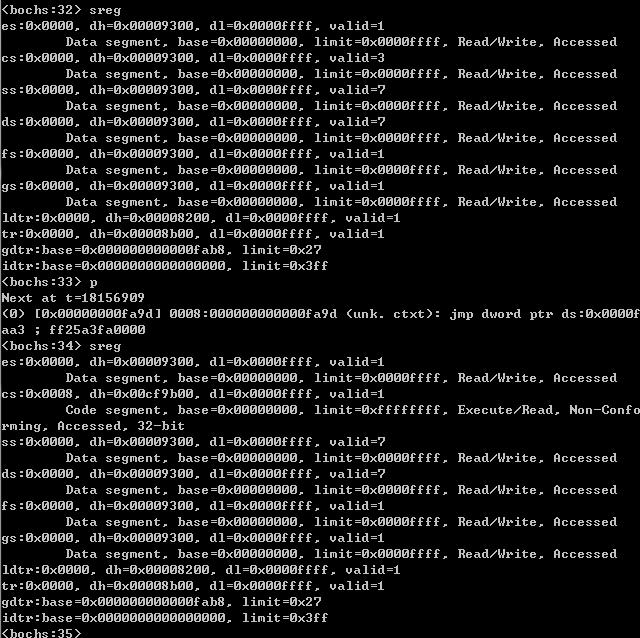

上一篇总结了ReactOS系统的MBR以及DBR的执行逻辑，DBR最终解析FAT32文件系统，找到FreeLdr.sys文件并加载到0x0F80:0x0000内存位置。在DBR执行的结尾处，跳转到该地址处继续执行。这一篇分析一下FreeLdr.sys文件的执行。

文件FreeLdr.sys文件可以在安装完的ReactOS系统的系统盘中找到，或者在ReactOS的ISO安装包中位于loader目录下。这个文件和Windows系统的NTLDR非常像，它由Startup和OsLoader.exe两个文件拼接而成，其中OsLoader.exe是一个真正的PE文件。查看FreeLdr.sys文件十六进制形式（如图1所示）可以发现，文件虽然以`.sys`结尾，但该文件并非完整的PE文件，而是多个文件拼接而成。如图2所示，在FreeLdr.sys文件的0x0800偏移处为一个PE文件的起始。

<div align="center">

</div>

<div align="center">

</div>

这里我们将FreeLdr.sys分成两部分来看，从DBR跳转到0x0F80:0x0000内存位置要执行的代码其实是图1中所示的二进制部分；另外一部分就是sys文件的0x0800偏移处的PE文件。前一部分对应于两个源码文件，分别是`*\reactos\boot\freeldr\freeldr\arch\realmode\fathelp.inc`和`*\reactos\boot\freeldr\freeldr\arch\realmode\i386.S`。先给出fathelp.inc的内容，它的代码如下所示。

```
// This code will be stored in the first 512 bytes
// of freeldr.sys. The first 3 bytes will be a jmp
// instruction to skip past the FAT helper code
// that is stored in the rest of the 512 bytes.
// 这块代码保存在freeldr.sys文件的前512字节。其中的前
// 3个字节会是一个jmp指令跳过FAT辅助代码（512字节剩下的内容）

PUBLIC start
start:
    // 这块代码加载到0000:F800，因此需要设置jmp指令跳转到 0000:FA00
    .byte HEX(e9), HEX(fd), HEX(01)

// Now starts the extra boot code that we will store
// in the first 512 bytes of freeldr.sys. This code
// allows the FAT12/16 bootsector to navigate the
// FAT table so that we can still load freeldr.sys
// even if it is fragmented.
// 现在开始额外的引导代码，这些代码会被存在freeldr.sys文件起始的512字节中
// 代码用于FAT12/16引导扇区搜索FAT表，即使freeldr.sys是碎片存储，也可以加载

FatHelperEntryPoint:
    /* 首先保存 AX，freeldr.sys的起始簇号 */
    push ax

    /* 显示"Loading FreeLoader..."消息 */
    mov si, offset msgLoading
    call word ptr [bp-PutCharsOffset]

    call ReadFatIntoMemory

    /* 恢复AX(起始簇号) */
    pop ax

    // AX 中保存了freeldr.sys文件的起始簇号
    mov  bx, FREELDR_BASE / 16
    mov  es,bx
```

从上面代码中可以看出，ReactOS使用FAT32文件系统格式，因此FreeLdr.sys的前512字节中有用的内容就只有前三个字节，jmp指令，从注释可以发现它会跳转到`0x0000:0xFA00`地址处，这个地方恰好是掠过`FreeLdr.sys`文件的前512字节的内容，这块内容其实是前面提的到的另外一个文件`i386.S`编译出来的，下面给出这个文件的源码。

```
#include <asm.inc>
#include "../../include/arch/pc/x86common.h"

#define IMAGE_DOS_HEADER_e_lfanew 60
#define IMAGE_FILE_HEADER_SIZE 20
#define IMAGE_OPTIONAL_HEADER_AddressOfEntryPoint 16

.code16
/* fat helper code 即FreeLdr.sys的前512字节内容，包含进来进行编译 */
#include "fathelp.inc"

.org 512           ; .org宏，指示汇编器直接到512字节开始汇编，即空出前面512字节
RealModeEntryPoint:
    cli

    /* 设置段寄存器 */
    xor ax, ax
    mov ds, ax
    mov es, ax
    mov fs, ax
    mov gs, ax
    mov ss, ax

    /* 设置栈指针 STACK16ADDR = 0x6F00，栈顶0000:6F00*/
    mov sp, word ptr ds:[stack16]

    /* 开启A20地址线 */
    call EnableA20

    /* 位于实模式中的“BSS section”部分，安全实模式入口点 位于实模式栈之后 一块内存保存未初始化全局变量*/
    mov dword ptr ds:[BSS_RealModeEntry], offset switch_to_real16

    /* 使用ES段寄存器作为基础，定位PE文件 FREELDR_PE_BASE = HEX(10000)*/
    mov ax, FREELDR_PE_BASE / 16
    mov es, ax

    /* 获取DOS头中可选头偏移 IMAGE_DOS_HEADER_e_lfanew = 60（0x3C） */
    mov eax, dword ptr es:[IMAGE_DOS_HEADER_e_lfanew]
    add eax, 4 + IMAGE_FILE_HEADER_SIZE      ; IMAGE_FILE_HEADER_SIZE = 20（0x14）

    /* 获取PE文件的入口点偏移值 IMAGE_OPTIONAL_HEADER_AddressOfEntryPoint=16（0x10）*/
    mov eax, dword ptr es:[eax + IMAGE_OPTIONAL_HEADER_AddressOfEntryPoint]
    add eax, FREELDR_PE_BASE     ; 计算PE入口点实际的物理地址

    /* 设置后面 要跳转的目的地址，即入口点 */
    mov dword ptr ds:[pm_entrypoint], eax

    /* Restore es */
    xor ax, ax
    mov es, ax

    jmp exit_to_protected    ; 进入保护模式

/* 这里是从保护模式进入实模式时的入口点 */
switch_to_real16:

    /* 保存段寄存器到正确的限制 */
    mov ax, RMODE_DS
    mov ds, ax
    mov es, ax
    mov fs, ax
    mov gs, ax
    mov ss, ax

    /* 关闭保护模式 */
    mov eax, cr0
    and eax, CR0_PE_CLR
    mov cr0, eax

    /* 清空指令预取队列，并且纠正CS寄存器值 */
    ljmp16 0, inrmode

inrmode:
    /* 设置实模式的段寄存器 */
    xor ax, ax
    mov ds, ax
    mov es, ax
    mov fs, ax
    mov gs, ax
    mov ss, ax

    /* 清除ESP的高16位。*/
    /* 这个操作还是必要的，我这边有一台机器，当ESP高16位*/
    /* 不是0x0000时，系统就挂起了，即使实模式使用SP，并不使用ESP */
    xor esp, esp

    /* 恢复实模式的栈 */
    mov sp, word ptr ds:[stack16]

    /* 在IDTR中加载实模式的值 */
#ifdef _USE_ML
    lidt fword ptr rmode_idtptr
#else
    lidt rmode_idtptr
#endif

    sti /* 开启中断*/

    /* 调用BX指定的回调函数 */
    shl bx, 1
    call word ptr ds:callback_table[bx]
/*
 * CPU转向保护模式，EAX值会被破坏掉
 */
exit_to_protected:
    cli ; 关中断

    mov word ptr ds:[stack16], sp ; 保存实模式下的栈指针，用于回到实模式时使用

#ifdef _USE_ML    /* 加载GDT */
    lgdt fword ptr gdtptr
#else
    lgdt gdtptr
#endif

    mov eax, cr0         ; 开启保护模式
    or eax, CR0_PE_SET
    mov cr0, eax

    ;清空指令预取队列，并纠正CS值，跳转后CS变为0x0008 按照保护模式解析CS，即GDT的第二项
    ljmp16 PMODE_CS, inpmode
inpmode:
    .byte HEX(0ff), HEX(25) // 直接跳转指令的opcode，跳转到pm_entrypoint指向的地址
    .word pm_entrypoint, 0
pm_entrypoint:
    .long 0           // 接收PE入口点地址，用于开启保护模式后跳转过去
    nop

callback_table:		// 转回实模式用到的回调表
    .word Int386
    .word Reboot
    .word ChainLoadBiosBootSectorCode
    .word PxeCallApi
    .word PnpBiosGetDeviceNodeCount
    .word PnpBiosGetDeviceNode
    .word BootLinuxKernel

    /* 16位栈指针 */
stack16:
    .word    STACK16ADDR

.align 4    /* force 4-byte alignment */
gdt:
    /* NULL Descriptor */
    .word HEX(0000)
    .word HEX(0000)
    .word HEX(0000)
    .word HEX(0000)

    /* 32-bit flat CS */
    .word HEX(FFFF)
    .word HEX(0000)
    .word HEX(9A00)
    .word HEX(00CF)

    /* 32-bit flat DS */
    .word HEX(FFFF)
    .word HEX(0000)
    .word HEX(9200)
    .word HEX(00CF)

    /* 16-bit real mode CS */
    .word HEX(FFFF)
    .word HEX(0000)
    .word HEX(9E00)
    .word HEX(0000)

    /* 16-bit real mode DS */
    .word HEX(FFFF)
    .word HEX(0000)
    .word HEX(9200)
    .word HEX(0000)

/* GDT table pointer */
gdtptr:
    .word HEX(27)       /* Limit */
    .word gdt, 0        /* Base Address */

/* Real-mode IDT pointer */
rmode_idtptr:
    .word HEX(3ff)      /* Limit */
    .long 0             /* Base Address */

#include "int386.inc"
#include "pxe.inc"
#include "pnp.inc"
#include "linux.inc"
#include "helpers.inc"

.org (FREELDR_PE_BASE - FREELDR_BASE - 1)
.byte 0
.endcode16
END
```

有了前面的MBR等汇编代码分析，这里的代码阅读就简单多了。首先将所有的段寄存器全都清空了，然后设置了栈寄存器SP，将16位实模式的栈顶设置到了`0000:6F00`。调用EnableA20()函数开启A20地址线，下面给出开启A20地址线的代码。开启A20地址线的方法有很多，比如使用8042控制器，BIOS INT 15H等。有一些方法是不通用的，ReactOS这里使用的是8042键盘控制器。首先等待8042控制器的输入缓存为空（方法就是不断读取控制器64H端口数据，确定第二位是否为0）！输入缓存为空了，就向64H端口写入D1h，告诉控制器要向外写数据了！等到执行完毕（采取和前面相同方法等待），就可以向60H端口写DFh，开启A20，并等待命令执行完毕！

无论是否开启A20地址线，80286及之后的CPU在实模式下可访问地址范围最大也是`FFFF:FFFFh`，即10FFEF，这由实模式的寻址结构决定！进入保护模式是否可以不开启A20地址线呢？答案是肯定的，但是由于A20地址线始终未0，则只能寻址1M，3M，5M等奇数的内存块，无法寻址整个地址空间！

```
Empty8042:
    .word HEX(00eb), HEX(00eb)      // jmp $+2, jmp $+2 这两条指令比较常用，用于延时
    in al, HEX(64)                  // 8042芯片64H端口读数据
    cmp al, HEX(0ff)                // legacy-free machine without keyboard
    jz Empty8042_ret                // controllers on Intel Macs read back 0xFF
    test al, 2
    jnz Empty8042
Empty8042_ret:
    ret

EnableA20:
    pusha
    call Empty8042                  // 等待8042输入buffer空
    mov al, HEX(0D1)                // 发送命令给控制器，D1H表示要写数据
    out HEX(064), al
    call Empty8042                  // 等待输入buffer空，即等前一个命令执行完毕
    mov al, HEX(0DF)                // A20 on 向60H端口写数据，开启A20
    out HEX(060), al
    call Empty8042                  // 等待输出buffer空，即完成开启
    popa
    ret
```

开启了A20地址线之后进行了如下几项工作：

* 设置返回实模式的入口点`switch_to_real16`
* 根据FreeLdr.sys中PE文件的位置，找到PE文件入口点，并设置到跳转指令中
* 开启保护模式，跳转到PE入口点继续执行（这里需要关中断，保存实模式栈指针，加载GDT，然后开启CR0的PE位）

```
#define BSS_START           HEX(6F00)

/* 这些地址指定了实模式下的"BSS section"分布，定义了一些全局变量，用于从保护模式回到实模式 */
#define BSS_RealModeEntry        (BSS_START + 0)
```

如图3显示了开启保护模式，在Bochs的调试中可以看到CR0的PE位（第一位）被置位（大写显示）。

<div align="center">

</div>

开启了保护模式后，段寄存器的意义就发生了变化，再寻址时就需要使用到GDT表。代码段寄存器CS的更新就是在0xFA98处的跳转指令完成，它一方面跳转到0x0008:FA9D，清空预取指令，另外一方面将CS段寄存器进行重置。图4给出了指令执行前后段寄存器CS的变化。

<div align="center">

</div>

最后通过一条跳转指令，对pm_entrypoint间接寻址到保存在其中的PE入口地址，从而跳转到PE文件的入口处继续执行，如图5所示。

<div align="center">

</div>

上面执行完之后，进入了保护模式（A20地址线肯定开启了），且跳转到PE文件的入口点继续执行。通过IDA反汇编和PE解析器可以发现入口函数其实就是RealEntryPoint()函数，它位于`*\reactos\boot\freeldr\freeldr\arch\i386\entry.S`文件中。

```
#include <asm.inc>
#include <arch/pc/x86common.h>
#include <arch/pc/pcbios.h>

EXTERN _BootMain:PROC
EXTERN _InitIdt:PROC
EXTERN _i386Idt:DWORD
//EXTERN _i386idtptr:FWORD

.code32

PUBLIC _RealEntryPoint
_RealEntryPoint:

    ; 设置段选择子
    mov ax, PMODE_DS
    mov ds, ax
    mov es, ax
    mov fs, ax
    mov gs, ax
    mov ss, ax

    mov esp, dword ptr ds:[stack32]  ; 设置保护模式使用的栈，0000:F000h为栈顶

#ifdef _USE_ML   ; 加载IDT
    lidt fword ptr ds:[i386idtptr]
#else
    lidt i386idtptr
#endif

    jmp dword ptr ds:[ContinueAddress] ; 继续执行

PUBLIC ContinueAddress
ContinueAddress:
    .long _FrldrStartup

_FrldrStartup:
    mov byte ptr ds:[_FrldrBootDrive], dl  ; 保存引导驱动器和引导扇区
    xor eax, eax
    mov al, dh
    mov dword ptr ds:[_FrldrBootPartition], eax

    mov eax, dword ptr ds:[BSS_RealModeEntry] ; 将返回16位实模式入口地址填充到跳转指令 地址字段
    mov dword ptr ds:[SwitchToReal16Address], eax

    call _InitIdt   ; 初始化IDT

#ifndef _USE_ML
    xor eax, eax  ; 清空 bss
    mov edi, offset __bss_start__
    mov ecx, offset __bss_end__ + 3
    sub ecx, edi
    shr ecx, 2
    rep stosd

    mov eax, offset cmdline  ; 设置给BootMain传递的参数值（命令行）
#else
    xor eax, eax    ; 编译时其实用的是这块代码
#endif
    push eax   ; 调用BootMain函数
    call _BootMain

    /* We should never get here */
stop:
    jmp stop
    nop
    nop

;--------------------------------------------------------------
/* GDT table pointer */
gdtptr:
    .word HEX(27)       /* Limit */
    .long gdt           /* Base Address */

/* Real-mode IDT pointer */
rmode_idtptr:
    .word HEX(3ff)      /* Limit */
    .long 0             /* Base Address */

PUBLIC i386idtptr
i386idtptr:
    .word 255           /* Limit */
    .long _i386Idt      /* Base Address */

PUBLIC _FrldrBootDrive
_FrldrBootDrive:
    .byte 0

PUBLIC _FrldrBootPartition
_FrldrBootPartition:
    .long 0
END
```

函数RealEntryPoint()的逻辑也相对简单。此刻已经进入了保护模式，要对段寄存器进行更新，否则直接使用会出错，依次将CS之外的寄存器全都初始化为指向GDT第三项（Index为2）的值；再者进入保护模式，要构建保护模式使用的栈，16位实模式使用的栈还要留着回到实模式时使用，这里不混用；加载IDT表，不再使用实模式下的中断，要使用保护模式的IDT表，紧接着要将IDT表初始化（在初始化IDT表时调用的是一个C语言编写的函数，该函数位于文件`*\reactos\boot\freeldr\freeldr\arch\i386\i386idt.c`中，就是对IDT表的表项逐一进行设置，这里不再列出），否则一旦发生了异常或中断，中断表为空则会出错；在上一段代码中曾经保存了返回16位实模式的入口函数地址，这里将它复制到新的几个需要返回到实模式的函数的跳转指令中，用于返回实模式用；最后构造函数调用栈，调用BootMain()函数，这个函数位于`*\reactos\boot\freeldr\freeldr\freeldr.c`，终于到了C语言编写的文件中了，哈哈哈！

总结一下到目前计算机执行的过程：

* MBR被BIOS加载到0x7C00地址处，并跳转过去执行
* MBR根据分区表，找到活动分区，加载DBR并跳转到DBR执行
* DBR以及DBR扩展代码解析FAT32文件系统，加载FreeLdr.sys文件，并跳转加载地址执行
* FreeLdr.sys前半部分开启A20地址线，加载GDT，进入保护模式，加载IDT，初始化IDT表
* 跳转到FreeLdr.sys的BootMain()函数执行

从上述过程可以发现，进入了保护模式，但是未开启分页；加载GDT/IDT，可以进行中断响应，但是从中断表的初始化可知可响应中断或异常非常少；后期还有大量初始化工作需要完成。由于内容繁多，后文分主题进行总结。这里的主题分割没有固定模式，以启动流程为主线，逐一学习流程，简单话题一带而过，大话题则单劈小节专门总结，主题划分如下所示。

* BootMain()函数执行流程
* 内存管理器初始化过程
* RunLoader()函数执行过程
* 启动操作系统选择
* LoadReactOSSetup()函数执行过程
* LoadAndBootWindowsCommon()函数执行过程

#### BootMain函数 ####

进入BootMain()函数，在前面调试时可以发现，BootMain()函数构造调用栈时，压入EAX寄存器是0，也即这里的CmdLine参数为NULL。函数调用的第一个函数CmdLineParse()解析命令行，获取命令行中配置参数，处理命令行，参数和调试信息相关，这里不做过多解析。

```
VOID __cdecl BootMain(IN PCCH CmdLine)
{
    CmdLineParse(CmdLine);

    DebugInit(FALSE);    // 调试器预初始化

    TRACE("BootMain() called.\n");
    MachInit(CmdLine);

    // 检查CPU是否满足兼容性，足够新
    FrLdrCheckCpuCompatibility(); // FIXME: Should be done inside MachInit!

    if (!UiInitialize(FALSE))    // UI预初始化，从这里调用，就是调用个空函数
    {
        UiMessageBoxCritical("Unable to initialize UI.");
        goto Quit;
    }

    if (!MmInitializeMemoryManager())  // 初始化内存管理器
    {
        UiMessageBoxCritical("Unable to initialize memory manager.");
        goto Quit;
    }

    FsInit();       // 初始化 I/O子系统

    RunLoader();    // 继续执行Loader

Quit:
    /* If we reach this point, something went wrong before, therefore reboot */
    DiskStopFloppyMotor();
    Reboot();
}
```

第二个调用函数为DebugInit()，它用作调试初始化。在系统的启动过程中，它会被调用两次，一次就是这里，传参FALSE；另外一次在MainInit的地方。根据传参可知此处调用该函数所做的工作比较简单：

1. 设置调试级别（错误，FixMe，Warn，Trace开启几个）
2. 获取之前传入的命令行，解析其中和调试设置相关的值（如DEBUGPORT/BAUDTRATE等），设置给全局变量

第三个调用函数为MachInit()，这个函数为CPU架构相关初始化。不同平台的该函数位于不同文件，这里是i386平台，它的代码位于"*\reactos\boot\freeldr\freeldr\arch\i386\archmach.c"文件中，代码不多如下代码块所示。从代码中可以发现，这里完成了和架构相关的一些函数的赋值保存，用于之后启动过程中调用。

```
VOID MachInit(const char *CmdLine)
{
  ULONG PciId;

  memset(&MachVtbl, 0, sizeof(MACHVTBL));		// 结构体，保存了架构相关的一些函数，如输出字符

  /* Check for Xbox by identifying device at PCI 0:0:0, if it's
   * 0x10de/0x02a5 then we're running on an Xbox */ // 校验是否XBox虚拟机
  WRITE_PORT_ULONG((ULONG*) 0xcf8, CONFIG_CMD(0, 0, 0));
  PciId = READ_PORT_ULONG((ULONG*) 0xcfc);
  if (0x02a510de == PciId)
  {
      XboxMachInit(CmdLine);
  }
  else
  {
      PcMachInit(CmdLine);
  }

  HalpCalibrateStallExecution();    // 进行CPU停顿执行校准，主要用于调整定时等
}

// 位于Machpc.c文件中，完成MachVtbl结构体的赋值，符合当前CPU平台，完成一些底层操作
VOID PcMachInit(const char *CmdLine)
{
    /* Setup vtbl */
    MachVtbl.ConsPutChar = PcConsPutChar;
    MachVtbl.ConsKbHit = PcConsKbHit;
    MachVtbl.ConsGetCh = PcConsGetCh;
    MachVtbl.VideoClearScreen = PcVideoClearScreen;
    MachVtbl.VideoSetDisplayMode = PcVideoSetDisplayMode;
    MachVtbl.VideoGetDisplaySize = PcVideoGetDisplaySize;
    MachVtbl.VideoGetBufferSize = PcVideoGetBufferSize;
    MachVtbl.VideoSetTextCursorPosition = PcVideoSetTextCursorPosition;
    MachVtbl.VideoHideShowTextCursor = PcVideoHideShowTextCursor;
    MachVtbl.VideoPutChar = PcVideoPutChar;
    MachVtbl.VideoCopyOffScreenBufferToVRAM = PcVideoCopyOffScreenBufferToVRAM;
    MachVtbl.VideoIsPaletteFixed = PcVideoIsPaletteFixed;
    MachVtbl.VideoSetPaletteColor = PcVideoSetPaletteColor;
    MachVtbl.VideoGetPaletteColor = PcVideoGetPaletteColor;
    MachVtbl.VideoSync = PcVideoSync;
    MachVtbl.Beep = PcBeep;
    MachVtbl.PrepareForReactOS = PcPrepareForReactOS;
    MachVtbl.GetMemoryMap = PcMemGetMemoryMap;
    MachVtbl.DiskGetBootPath = PcDiskGetBootPath;
    MachVtbl.DiskReadLogicalSectors = PcDiskReadLogicalSectors;
    MachVtbl.DiskGetDriveGeometry = PcDiskGetDriveGeometry;
    MachVtbl.DiskGetCacheableBlockCount = PcDiskGetCacheableBlockCount;
    MachVtbl.GetTime = PcGetTime;
    MachVtbl.InitializeBootDevices = PcInitializeBootDevices;
    MachVtbl.HwDetect = PcHwDetect;
    MachVtbl.HwIdle = PcHwIdle;

    // DiskGetPartitionEntry = DiskGetMbrPartitionEntry; // Default
}
```

第三个调用函数为FrLdrCheckCpuCompatibility()，这个主要完成CPU兼容性校验，注释中也看到作者认为这个函数应该在MachInit()函数中调用，这个函数中调用CPUID指令，校验CPU是否支持一些特性，简单略过。

第四个调用函数为UiInitialize()，传参为FALSE。这个函数完成的是UI的预初始化，对于这个函数传参FALSE，直接调用NoUiInitialize()空函数。

```
BOOLEAN UiInitialize(BOOLEAN ShowGui)
{
    VIDEODISPLAYMODE    UiDisplayMode; // Tells us if we are in text or graphics mode
    BOOLEAN UiMinimal = FALSE; // Tells us if we are using a minimal console-like UI
    ULONG_PTR SectionId;
    CHAR    DisplayModeText[260];
    CHAR    SettingText[260];
    ULONG    Depth;

    if (!ShowGui)
    {
        if (!UiVtbl.Initialize())
        {
            MachVideoSetDisplayMode(NULL, FALSE);
            return FALSE;
        }
        return TRUE;
    }

    ...                    // 省略余下代码，后面遇到再看
```

第五个调用的参数为MmInitializeMemoryManager()，这个函数完成内存管理器的初始化。这一部分在第二个小节详细总结一下，这里先略过。

第六个调用的函数是FsInit()，完成I/O子系统的初始化，代码如下。代码很简单，简单将I/O系统的设备ID初始化，初始化设备列表头指针。

```
VOID FsInit(VOID)
{
    ULONG i;

    RtlZeroMemory(FileData, sizeof(FileData));
    for (i = 0; i < MAX_FDS; i++)	// >
        FileData[i].DeviceId = (ULONG)-1;

    InitializeListHead(&DeviceListHead);

    // FIXME: Retrieve the current boot device with MachDiskGetBootPath
    // and store it somewhere in order to not call again and again this
    // function.
}
```

最后调用RunLoader()，这个函数进一步进行系统启动的准备工作。这个函数是下一步流程，这里在第三个小节专门总结它的内容。

#### 内存管理器初始化过程 ####

内存管理在Windows中很重要，开启分页使用虚拟地址后，这块内容更加复杂与重要。MmInitializeMemoryManager()函数在这里只是对物理地址空间管理器的初始化。下面总结一下这个函数的执行过程，以及其中涉及到的一些重要的方面。

```
BOOLEAN MmInitializeMemoryManager(VOID)
{
#if DBG
    const FREELDR_MEMORY_DESCRIPTOR* MemoryDescriptor = NULL;
#endif
    TRACE("Initializing Memory Manager.\n");

    MmCheckFreeldrImageFile();    // 校验FreeLdr.sys二进制文件是否满足PE结构

    BiosMemoryMap = MachVtbl.GetMemoryMap(&BiosMemoryMapEntryCount); // 获取Bios的内存映射结构
#if DBG
    TRACE("System Memory Map (Base Address, Length, Type):\n");   // Dump the system memory map
    while ((MemoryDescriptor = ArcGetMemoryDescriptor(MemoryDescriptor)) != NULL)
    {
        TRACE("%x\t %x\t %s\n",
            MemoryDescriptor->BasePage * MM_PAGE_SIZE,
            MemoryDescriptor->PageCount * MM_PAGE_SIZE,
            MmGetSystemMemoryMapTypeString(MemoryDescriptor->MemoryType));
    }
#endif
    // Find address for the page lookup table
    TotalPagesInLookupTable = MmGetAddressablePageCountIncludingHoles();
    PageLookupTableAddress = MmFindLocationForPageLookupTable(TotalPagesInLookupTable);
    LastFreePageHint = MmHighestPhysicalPage;

    if (PageLookupTableAddress == 0)
    {
        // If we get here then we probably couldn't
        // find a contiguous chunk of memory big
        // enough to hold the page lookup table
        printf("Error initializing memory manager!\n");
        return FALSE;
    }

    // Initialize the page lookup table
    MmInitPageLookupTable(PageLookupTableAddress, TotalPagesInLookupTable);

    MmUpdateLastFreePageHint(PageLookupTableAddress, TotalPagesInLookupTable);

    FreePagesInLookupTable = MmCountFreePagesInLookupTable(PageLookupTableAddress,
                                                        TotalPagesInLookupTable);

    MmInitializeHeap(PageLookupTableAddress);
    TRACE("Memory Manager initialized. 0x%x pages available.\n", FreePagesInLookupTable);

    return TRUE;
}
```

函数首先校验FreeLdr.sys这个二进制文件是否是完整的PE文件，这里就是简单对PE文件头及大小的验证，不再详述；调用架构初始化时设置的CPU架构相关的一些底层函数中的GetMemoryMap函数指针，它实际对应于PcMemGetMemoryMap()函数，在下面给出这个函数的代码。

从PcMemGetMemoryMap()函数名字可以猜测此函数是获取物理内存的映射，它首先调用了PcMemGetBiosMemoryMap()获取了BIOS内存映射，该函数最重要的部分就是调用BIOS INT 15H E820H功能获取内存映射状态。从代码中可以看到，它准备了INT 15H E820H的参数，然后调用了Int386()函数（Int386()函数涉及到从保护模式切换回实模式调用BIOS功能，再从实模式切换回保护模式，这个在小节后面单拿出来分析一下这个过程）。

Int386()函数功能和实模式下调用INT 15H E820H相同，循环调用直到没有空闲内存为止。将获取的内存信息，根据内存状态设置不同的描述符类型，然后将描述符填写到PcMemoryMap内存映射信息表中。函数AddMemoryDescriptor()完成了内存信息描述符插入列表的操作，纯数据操作相对简单不再详述。有一点需要注意的是PcMemoryMap列表是一个数组，从第一项到最后一项（没有更多内存信息，则将最后一项置空）依次保存了从低地址到高地址的空闲内存内存段；对于调用BIOS功能获取的内存信息，有一些地址空间是相邻的，但是可能通过两次调用获取，这时候在插入描述块时就需要将描述块合并。

```
static ULONG PcMemGetBiosMemoryMap(PFREELDR_MEMORY_DESCRIPTOR MemoryMap, ULONG MaxMemoryMapSize)
{
    REGS Regs;
    ULONGLONG RealBaseAddress, EndAddress, RealSize;
    TYPE_OF_MEMORY MemoryType;
    ULONG Size, RequiredSize;
    ASSERT(PcBiosMapCount == 0);

    TRACE("GetBiosMemoryMap()\n");
    /* 确保可用内存足够大，校验BDA中的0x413地址处的16位值，这个值以KB为单位给出了可用内存值 */
    Size = (*(PUSHORT)(ULONG_PTR)0x413) * 1024;
    RequiredSize = FREELDR_BASE + FrLdrImageSize + PAGE_SIZE;
    if (Size < RequiredSize)  // >可用内存太小，不足够放FreeLdr.sys文件，报错
    {
        FrLdrBugCheckWithMessage( MEMORY_INIT_FAILURE, __FILE__, __LINE__,
            "The BIOS reported a usable memory range up to 0x%x, which is too small!\n"
            "Required size is 0x%x\n\n"
            "If you see this, please report to the ReactOS team!",
            Size, RequiredSize);
    }
	// 这里使用 BIOS的INT 15H E820H功能获取系统的内存映射
    /* Int 15h AX=E820h
     * Newer BIOSes - 获取系统内存映像（有那些块，占用那些地址空间）
     *
     * AX = E820h
     * EAX = 0000E820h
     * EDX = 534D4150h ('SMAP')
     * EBX = 上一次获取值，或者是0x00000000作为检验起始值
     * ECX = 用于保存结果的缓存大小，字节单位，应该大于20 bytes
     * ES:DI -> 用于保存执行结果
     * 执行返回值:
     * CF 标记为CF被清空
     * EAX = 534D4150h ('SMAP')
     * ES:DI 结果缓存被填充
     * EBX = 如果为0，则结束，否则是下一个偏移值
     * ECX = 结果数据的实际长度
     * CF 如果被置位，则出现错误，AH中保存错误码
     * AH = error code (86h)
     */
    Regs.x.ebx = 0x00000000;

    while (PcBiosMapCount < MAX_BIOS_DESCRIPTORS) // >
    {
        Regs.x.eax = 0x0000E820;   // 设置调用BIOS 的寄存器
        Regs.x.edx = 0x534D4150; /* ('SMAP') */
        /* Regs.x.ebx = 0x00000001;  Continuation value already set */
        Regs.x.ecx = sizeof(BIOS_MEMORY_MAP);
        Regs.w.es = BIOSCALLBUFSEGMENT;
        Regs.w.di = BIOSCALLBUFOFFSET;
        Int386(0x15, &Regs, &Regs);

        // 如果BIOS没有在EAX中返回'SMAP'，说明它不支持调用，如果设置了CF，说明出错了
        if (Regs.x.eax != 0x534D4150 || !INT386_SUCCESS(Regs))
            break;

        // 将数据拷贝到全局缓存中
        RtlCopyMemory(&PcBiosMemoryMap[PcBiosMapCount], (PVOID)BIOSCALLBUFFER, Regs.x.ecx);

        // 检查是否是自由内存，可用
        if (PcBiosMemoryMap[PcBiosMapCount].Type == BiosMemoryUsable)
        {
            MemoryType = LoaderFree;

            // 对内存范围基址进行对齐
            RealBaseAddress = ALIGN_UP_BY(PcBiosMemoryMap[PcBiosMapCount].BaseAddress,
                                          PAGE_SIZE);

            // 计算对齐的结尾地址
            EndAddress = PcBiosMemoryMap[PcBiosMapCount].BaseAddress +
                         PcBiosMemoryMap[PcBiosMapCount].Length;
            EndAddress = ALIGN_DOWN_BY(EndAddress, PAGE_SIZE);

            // 检查对齐后是否有一些内存剩下了
            if (EndAddress <= RealBaseAddress)  // >
            {
                /* This doesn't span any page, so continue with next range */
                continue;
            }

            // 计算对齐范围的长度
            RealSize = EndAddress - RealBaseAddress;
        }
        else
        {	// 非自由使用内存，则设置类型
            if (PcBiosMemoryMap[PcBiosMapCount].Type == BiosMemoryReserved)
                MemoryType = LoaderFirmwarePermanent;
            else
                MemoryType = LoaderSpecialMemory;

            // 将内存进行对齐
            RealBaseAddress = ALIGN_DOWN_BY(PcBiosMemoryMap[PcBiosMapCount].BaseAddress,
                                            PAGE_SIZE);

            /* Calculate the length after aligning the base */
            RealSize = PcBiosMemoryMap[PcBiosMapCount].BaseAddress +
                       PcBiosMemoryMap[PcBiosMapCount].Length - RealBaseAddress;
            RealSize = ALIGN_UP_BY(RealSize, PAGE_SIZE);
        }

        // 是否要将内存加入到描述符表，用于以后内存使用
        if ((RealSize >= MM_PAGE_SIZE) && (PcMapCount < MaxMemoryMapSize))  // >
        {
            /* Add the descriptor */
            PcMapCount = AddMemoryDescriptor(PcMemoryMap,
                                           MAX_BIOS_DESCRIPTORS,
                                           (PFN_NUMBER)(RealBaseAddress / MM_PAGE_SIZE),
                                           (PFN_NUMBER)(RealSize / MM_PAGE_SIZE),
                                           MemoryType);
        }

        PcBiosMapCount++;

        /* 如果继续搜索的内存值为0，或进位标记CF被置位，那么就标记结束了*/
        if (Regs.x.ebx == 0x00000000)
        {
            TRACE("End Of System Memory Map!\n\n");
            break;
        }
    }

    TRACE("GetBiosMemoryMap end, PcBiosMapCount = %ld\n", PcBiosMapCount);
    return PcBiosMapCount;
}

PFREELDR_MEMORY_DESCRIPTOR PcMemGetMemoryMap(ULONG *MemoryMapSize)
{
    ULONG i, EntryCount;
    ULONG ExtendedMemorySizeAtOneMB;
    ULONG ExtendedMemorySizeAtSixteenMB;
    ULONG EbdaBase, EbdaSize;
    TRACE("PcMemGetMemoryMap()\n");

    EntryCount = PcMemGetBiosMemoryMap(PcMemoryMap, MAX_BIOS_DESCRIPTORS);

    // 如果BIOS 没有提供内存映射，则尝试其他方法获取
    if (EntryCount == 0)
    {
        GetExtendedMemoryConfiguration(&ExtendedMemorySizeAtOneMB,
                                       &ExtendedMemorySizeAtSixteenMB);

        /* Conventional memory */
        AddMemoryDescriptor(PcMemoryMap,
                            MAX_BIOS_DESCRIPTORS,
                            0,
                            PcMemGetConventionalMemorySize() * 1024 / PAGE_SIZE,
                            LoaderFree);

        /* Extended memory */
        PcMapCount = AddMemoryDescriptor(PcMemoryMap,
                                         MAX_BIOS_DESCRIPTORS,
                                         1024 * 1024 / PAGE_SIZE,
                                         ExtendedMemorySizeAtOneMB * 1024 / PAGE_SIZE,
                                         LoaderFree);

        if (ExtendedMemorySizeAtSixteenMB != 0)
        {
            /* Extended memory at 16MB */
            PcMapCount = AddMemoryDescriptor(PcMemoryMap,
                                             MAX_BIOS_DESCRIPTORS,
                                             0x1000000 / PAGE_SIZE,
                                             ExtendedMemorySizeAtSixteenMB * 64 * 1024 / PAGE_SIZE,
                                             LoaderFree);
        }

        /* Check if we have an EBDA and get it's location */
        if (GetEbdaLocation(&EbdaBase, &EbdaSize))
        {
            /* Add the descriptor */
            PcMapCount = AddMemoryDescriptor(PcMemoryMap,
                                             MAX_BIOS_DESCRIPTORS,
                                             (EbdaBase / PAGE_SIZE),
                                             ADDRESS_AND_SIZE_TO_SPAN_PAGES(EbdaBase, EbdaSize),
                                             LoaderFirmwarePermanent);
        }
    }

    // 设置一些被保护的范围
    SetMemory(0x000000, 0x01000, LoaderFirmwarePermanent); // Realmode IVT / BDA
    SetMemory(0x0A0000, 0x50000, LoaderFirmwarePermanent); // Video memory
    SetMemory(0x0F0000, 0x10000, LoaderSpecialMemory); // ROM
    SetMemory(0xFFF000, 0x01000, LoaderSpecialMemory); // unusable memory (do we really need this?)

    /* Reserve some static ranges for freeldr */
    ReserveMemory(0x1000, STACKLOW - 0x1000, LoaderFirmwareTemporary, "BIOS area");
    ReserveMemory(STACKLOW, STACKADDR - STACKLOW, LoaderOsloaderStack, "FreeLdr stack");
    ReserveMemory(FREELDR_BASE, FrLdrImageSize, LoaderLoadedProgram, "FreeLdr image");

    /* Default to 1 page above freeldr for the disk read buffer */
    DiskReadBuffer = (PUCHAR)ALIGN_UP_BY(FREELDR_BASE + FrLdrImageSize, PAGE_SIZE);
    DiskReadBufferSize = PAGE_SIZE;

    /* Scan for free range above freeldr image */
    for (i = 0; i < PcMapCount; i++) // >
    {
        if ((PcMemoryMap[i].BasePage > (FREELDR_BASE / PAGE_SIZE)) &&
            (PcMemoryMap[i].MemoryType == LoaderFree))
        {
            /* Use this range for the disk read buffer */
            DiskReadBuffer = (PVOID)(PcMemoryMap[i].BasePage * PAGE_SIZE);
            DiskReadBufferSize = min(PcMemoryMap[i].PageCount * PAGE_SIZE,
                                     MAX_DISKREADBUFFER_SIZE);
            break;
        }
    }

    TRACE("DiskReadBuffer=%p, DiskReadBufferSize=%lx\n",
          DiskReadBuffer, DiskReadBufferSize);

    /* Now reserve the range for the disk read buffer */
    ReserveMemory((ULONG_PTR)DiskReadBuffer,
                  DiskReadBufferSize,
                  LoaderFirmwareTemporary,
                  "Disk read buffer");

    TRACE("Dumping resulting memory map:\n");
    for (i = 0; i < PcMapCount; i++) 	//>
    {
        TRACE("BasePage=0x%lx, PageCount=0x%lx, Type=%s\n",
              PcMemoryMap[i].BasePage,
              PcMemoryMap[i].PageCount,
              MmGetSystemMemoryMapTypeString(PcMemoryMap[i].MemoryType));
    }

    *MemoryMapSize = PcMapCount;
    return PcMemoryMap;
}
```

如果通过BIOS的INT 15H获取内存信息失败，则换其他方法尝试，包括INT 12H，INT 15H E801H，INT 15H C1H等获取内存信息，这个和通过INT 15H E820H获取内存类似。

在获取了系统的空闲内存之后，设置一些固定的地址范围的固定类型，用于特殊用途，如实模式的中断表IVT，BIOS Data Area，视频内存，ROM，和一些无法使用的内存区间。再者要为FreeLdr.sys保存静态的内容块，包括0x7C00占用段，使用的栈段，以及FreeLdr.sys的PE文件占用的内存。从保留的内存看，低4K内存留给了IVT和BIOS Data Area；0x1000~0x6000之间保留给BIOS，0x6000~0x7000分两部分，一部分给16位程序用作栈空间，另一部分用作全局变量，BSS段；0x7000~0xF000留给FreeLdr.sys的栈段，其中0x7C00开始的几个页面保存了DBR等数据；0xF800~FreeLdrEnd保留给FreeLdr.sys使用，这就基本是目前使用的所有内存空间。最后再FreeLdr.sys映像之上找一块空闲内存（最小64K），保留下来用于磁盘读取缓存；再有就是保留给显卡的缓存和ROM，以及不可用内存段，详细地址值可以参考代码。

从函数PcMemGetMemoryMap()返回的内存信息表BiosMemoryMap中，一方面包含了系统可用的空闲内存信息，另一方面将现有使用的物理内存标注了特殊标记。继续内存管理器初始化函数的逻辑，紧接着调用MmGetAddressablePageCountIncludingHoles()获取内存页的数量（其中包含了内存空洞），它的代码如下。代码很简单，遍历上面获取的BiosMemoryMap表内容，根据其中内存块状态设置最大，最小可用物理页号，最后根据两个值获取可用的物理页号数。

```
PFN_NUMBER MmGetAddressablePageCountIncludingHoles(VOID)
{
    const FREELDR_MEMORY_DESCRIPTOR* MemoryDescriptor = NULL;
    PFN_NUMBER PageCount;

    // 遍历整个内存信息表，获取最大的内存地址值
    while ((MemoryDescriptor = ArcGetMemoryDescriptor(MemoryDescriptor)) != NULL)
    {
        // 检查是否获得更高的页面地址
        if (MemoryDescriptor->BasePage + MemoryDescriptor->PageCount > MmHighestPhysicalPage)
        {
            // 如果当前描述符可用，则将最大的物理地址页号更新
            if (MemoryDescriptor->MemoryType == LoaderFree)
                MmHighestPhysicalPage = MemoryDescriptor->BasePage + MemoryDescriptor->PageCount;
        }

        // 检查是否获得更小的可用物理地址页
        if (MemoryDescriptor->BasePage < MmLowestPhysicalPage) //>
        {
            MmLowestPhysicalPage = MemoryDescriptor->BasePage;
        }
    }

    TRACE("lo/hi %lx %lx\n", MmLowestPhysicalPage, MmHighestPhysicalPage);
    PageCount = MmHighestPhysicalPage - MmLowestPhysicalPage;
    TRACE("MmGetAddressablePageCountIncludingHoles() returning 0x%x\n", PageCount);
    return PageCount;
}
```

调用MmFindLocationForPageLookupTable()函数构建可用物理内存查询表，即在操作系统分配物理内存时查询的表。通过源码发现，在寻找位置存放物理页面查找表时，一方面尽可能让表的地址处于高地址，另一方面放到可用内存块的尾部（例如一块1G物理内存，则放到这1G物理内存尾部）。

```
PVOID MmFindLocationForPageLookupTable(PFN_NUMBER TotalPageCount)
{
    const FREELDR_MEMORY_DESCRIPTOR* MemoryDescriptor = NULL;
    SIZE_T PageLookupTableSize;
    PFN_NUMBER PageLookupTablePages;
    PFN_NUMBER PageLookupTableStartPage = 0;
    PVOID PageLookupTableMemAddress = NULL;

    // 计算需要分配多少空间给页查找表
    PageLookupTableSize = TotalPageCount * sizeof(PAGE_LOOKUP_TABLE_ITEM);
    PageLookupTablePages = PageLookupTableSize / MM_PAGE_SIZE;

    // Search the highest memory block big enough to contain lookup table
    while ((MemoryDescriptor = ArcGetMemoryDescriptor(MemoryDescriptor)) != NULL)
    {
        if (MemoryDescriptor->MemoryType != LoaderFree) continue; // 内存块不空闲

        if (MemoryDescriptor->PageCount < PageLookupTablePages) continue; //> 内存块大小不够

        // 比先前搜寻基址还小，说明有问题
        if (MemoryDescriptor->BasePage < PageLookupTableStartPage) continue; // >

        if (MemoryDescriptor->BasePage >= MM_MAX_PAGE) continue;  // 大于系统支持的最大物理内存范围了

        // 找到一个比之前更加适合的块，放到内存块的末尾
        PageLookupTableStartPage = MemoryDescriptor->BasePage;
        PageLookupTableMemAddress = (PVOID)((ULONG_PTR)
            (MemoryDescriptor->BasePage + MemoryDescriptor->PageCount) * MM_PAGE_SIZE
            - PageLookupTableSize);
    }
    TRACE("MmFindLocationForPageLookupTable() returning 0x%x\n", PageLookupTableMemAddress);
    return PageLookupTableMemAddress;
}
```

将查找到的放置物理页面查找表调用MmInitPageLookupTable()进行初始化。这里有一些细节问题，前面BIOS获取的系统内存信息中的内存块可能不是连续的，其中有空洞，而物理页面查找表是从最低可用物理内存到最高可用物理内存整块分配。这样如果简单根据内存信息表设置物理页面查找表就漏掉了其中的空洞部分，所以需要将整个物理页面查找表先全部初始化为已分配，然后依据内存信息表遍历物理内存查找表设置各个对应页的状态。这种方法可以将内存"空洞"标注为已分配，以后操作系统在分配内存时就不会出现错误。通过初始化物理内存查找表，物理内存查找表自身占用的物理内存也就被分配出去了，需要标注为已分配，在函数最后完成了这项工作，这块内存被标注为LoaderFirmwareTemporary类型。

```
VOID MmMarkPagesInLookupTable(PVOID PageLookupTable, PFN_NUMBER StartPage, PFN_NUMBER PageCount, TYPE_OF_MEMORY PageAllocated)
{
    PPAGE_LOOKUP_TABLE_ITEM RealPageLookupTable = (PPAGE_LOOKUP_TABLE_ITEM)PageLookupTable;
    PFN_NUMBER Index;
    TRACE("MmMarkPagesInLookupTable()\n");

    /* 验证有效性Validate the range */
    if ((StartPage < MmLowestPhysicalPage) ||
        ((StartPage + PageCount - 1) > MmHighestPhysicalPage))
    {
        ERR("Memory (0x%lx:0x%lx) outside of lookup table! Valid range: 0x%lx-0x%lx.\n",
            StartPage, PageCount, MmLowestPhysicalPage, MmHighestPhysicalPage);
        return;
    }

    StartPage -= MmLowestPhysicalPage;
    for (Index=StartPage; Index<(StartPage+PageCount); Index++) //>
    {
        RealPageLookupTable[Index].PageAllocated = PageAllocated;
        RealPageLookupTable[Index].PageAllocationLength = (PageAllocated != LoaderFree) ? 1 : 0;
    }
    TRACE("MmMarkPagesInLookupTable() Done\n");
}

VOID MmInitPageLookupTable(PVOID PageLookupTable, PFN_NUMBER TotalPageCount)
{
    const FREELDR_MEMORY_DESCRIPTOR* MemoryDescriptor = NULL;
    PFN_NUMBER PageLookupTableStartPage;
    PFN_NUMBER PageLookupTablePageCount;

    TRACE("MmInitPageLookupTable()\n");

    // 起始时将所有的页面都标记为已分配。然后根据内存映射信息表遍历，并重新标注空闲页。
    // 这样就将内存空间的空洞（未出现在内存映射信息表中）标记为已分配了
    MmMarkPagesInLookupTable(PageLookupTable, MmLowestPhysicalPage, TotalPageCount, LoaderFirmwarePermanent);

    // 解析整个内存映射信息表，重新标注空闲
    while ((MemoryDescriptor = ArcGetMemoryDescriptor(MemoryDescriptor)) != NULL)
    {
        // 根据内存映射表的内存块类型，在查找表中依次再次标注
        if (MemoryDescriptor->BasePage + MemoryDescriptor->PageCount <= TotalPageCount) //>
        {
            MmMarkPagesInLookupTable(PageLookupTable,
                                     MemoryDescriptor->BasePage,
                                     MemoryDescriptor->PageCount,
                                     MemoryDescriptor->MemoryType);
        }
    }

    // 将查找表占用的内存标注为保留
    PageLookupTableStartPage = MmGetPageNumberFromAddress(PageLookupTable);
    PageLookupTablePageCount = MmGetPageNumberFromAddress((PVOID)((ULONG_PTR)PageLookupTable + ROUND_UP(TotalPageCount * sizeof(PAGE_LOOKUP_TABLE_ITEM), MM_PAGE_SIZE))) - PageLookupTableStartPage;
    TRACE("Marking the page lookup table pages as reserved StartPage: 0x%x PageCount: 0x%x\n", PageLookupTableStartPage, PageLookupTablePageCount);
    MmMarkPagesInLookupTable(PageLookupTable, PageLookupTableStartPage, PageLookupTablePageCount, LoaderFirmwareTemporary);
}
```

MmUpdateLastFreePageHint()函数工作比较简单，遍历物理页面查找表找到最大空闲页号。MmCountFreePagesInLookupTable()函数则计算了物理页面查找表中空闲页面的数量，逻辑都比较简单，不再列举源码。

MmInitializeHeap()函数用于初始化加载器中使用的两个堆，代码如下所示。调用FrLdrHeapCreate()创建堆，该函数分配物理地址，然后初始化堆数据结构，返回堆指针。堆相关的内容也非常复杂，其数据结构以及相关算法在以后详细分析，这里不再过多解析。

```
VOID MmInitializeHeap(PVOID PageLookupTable)
{
    TRACE("MmInitializeHeap()\n");

    // 创建模式堆
    FrLdrDefaultHeap = FrLdrHeapCreate(DEFAULT_HEAP_SIZE, LoaderOsloaderHeap);
    ASSERT(FrLdrDefaultHeap);

    // 创建临时堆
    FrLdrTempHeap = FrLdrHeapCreate(TEMP_HEAP_SIZE, LoaderFirmwareTemporary);
    ASSERT(FrLdrTempHeap);

    TRACE("MmInitializeHeap() done, default heap %p, temp heap %p\n",
          FrLdrDefaultHeap, FrLdrTempHeap);
}
```

分配完加载器使用的默认堆和临时堆，内存管理器的初始化也就完成了。简单讲过程总结一下：

* 通过BIOS调用获取系统中的物理内存信息
* 计算物理内存总大小，分配物理内存查找表，并进行初始化设置
* 设置全局辅助变量，如最大空闲页提示量，查找表页面总数量，查找表中空闲页面数量等
* 最后分配两个堆，用于加载器分配内存

最后分析一下32位的Int386()函数的执行过程，这个函数中是调用BIOS功能，它涉及到从保护模式到实模式，再由实模式到保护模式的切换。从代码可以看到，这个函数被编译为32位代码，所以这里的汇编和C语言编译出来代码没啥区别，就是函数间调用。

```
.code32
EXTERN SwitchToReal:PROC
EXTERN ContinueAddress:DWORD

Int386_regsin:
    .long 0
Int386_regsout:
    .long 0

// int Int386(int ivec, REGS* in, REGS* out);
PUBLIC _Int386
_Int386:
    mov eax, dword ptr [esp + 4]    ; 获取函数参数
    mov dword ptr ds:[BSS_IntVector], eax
    mov eax, dword ptr [esp + 8]
    mov dword ptr [Int386_regsin], eax
    mov eax, dword ptr [esp + 12]
    mov dword ptr [Int386_regsout], eax

    push ds   ; 保存所有的通用寄存器和段寄存器
    push es
    push fs
    push gs
    pusha

    mov esi, dword ptr [Int386_regsin]  ; 拷贝输入参数（INT15 使用寄存器）
    mov edi, BSS_RegisterSet
    mov ecx, REGS_SIZE / 4
    rep movsd

    mov bx, FNID_Int386  ; 设置要调用函数ID

    mov dword ptr [ContinueAddress], offset Int386_return  ; 设置16位实模式返回地址，然后切换回实模式
    jmp SwitchToReal

Int386_return:
    mov esi, BSS_RegisterSet   ; 拷贝输出寄存器
    mov edi, dword ptr [Int386_regsout]
    mov ecx, REGS_SIZE / 4
    rep movsd

    popa    ; 恢复寄存器，继续执行
    pop gs
    pop fs
    pop es
    pop ds
    ret
END
```

首先根据ESP获取函数调用时压入栈上的三个参数，分别保存在几个全局变量中，`BSS_IntVector`为16位实模式栈上方保存的BSS段中变量的索引（这个可以在FreeLdr.sys入口点16位实模式代码中看到）。保存所有的段寄存器以及所有的通用寄存器（pusha），将输入参数（INT 15H用到的寄存器值）复制到BSS中的`BSS_RegisterSet`中备用，bx保存进入实模式后要调用的函数ID，`ContinueAddress`中保存从实模式的返回地址。`ContinueAddress`变量位于`entry.S`中，即之前进入保护模式时跳转的地址，第一次时`ContinueAddress`即紧邻之后的一条指令的地址，而之后从保护模式切回实模式再回到保护模式时，就重新设置了这个跳转地址，跳转到切到实模式之后的代码中继续执行了，充分重用代码。最后执行jmp指令进入切换模式的代码中。

要切换回实模式，直接跳转到`SwitchToReal`代码段，这个代码段在前面分析过的`entry.S`文件的后半部分（前面省略了），代码如下。这段代码比较简单，重置了段寄存器，保存32位栈指针，然后跳转到`switch_to_real16`代码段，这里使用跳转指令，一方面切换了代码段寄存器CS，另外一方面直接跳转到目标地址执行了。`SwitchToReal16Address`值初始值为0， 前面分析时看到过将`BSS_RealModeEntry`索引的BSS段的变量值放入SwitchToReal16Address这全局变量中，而`BSS_RealModeEntry`索引的BSS段在开启A20地址线之后，赋值为`switch_to_real16`了。

```
/* 实模式函数调用的入口点，ContinueAddress必须设置为从实模式到保护模式的返回点
 * bx 必须设置为要调用的实模式函数的ID值。*/
PUBLIC SwitchToReal
SwitchToReal:
    mov ax, PMODE_DS   ; 设置段寄存器
    mov ds, ax
    mov es, ax
    mov fs, ax
    mov gs, ax
    mov ss, ax

    mov dword ptr [stack32], esp   ; 保存32位的栈指针，放在了栈底之上

    ; 跳转到16位段，正确设置限制，如下的byte long word几个值的定义，其实就是如下的一条指令 switch_to_real16即16位代码
    .byte HEX(0ea) // jmp far RMODE_CS:switch_to_real16
SwitchToReal16Address:
    .long 0 // receives address of switch_to_real16
    .word RMODE_CS
    nop
```

那么这就是进入到了switch_to_real16代码块的执行了，这个代码块在前面出现过，这里再拿过来看一下（注：这个标号对应的代码是16位代码）。到BootMain为止，和CPU机制相关的设置只进行了A20地址线开启，保护模式开启，GDT/IDT设置等，所以此处关闭保护模式，重置IDT即可。然后根据函数表索引，调用`callback_table`函数表中的函数，即第一个函数Int386()，注意这里的这个函数位于`*\reactos\boot\freeldr\freeldr\arch\realmode\int386.inc`文件中，是实模式下调用的函数，要与i386目录下的int386.S中的32位函数区别。

```
/* 这里是从保护模式进入实模式时的入口点 */
switch_to_real16:
    mov ax, RMODE_DS  ; 保存段寄存器到正确的限制
    mov ds, ax
    mov es, ax
    mov fs, ax
    mov gs, ax
    mov ss, ax

    mov eax, cr0     ; 关闭保护模式
    and eax, CR0_PE_CLR
    mov cr0, eax

    ljmp16 0, inrmode  ; 清空指令预取队列，并且纠正CS寄存器值

inrmode:
    xor ax, ax  ; 设置实模式的段寄存器
    mov ds, ax
    mov es, ax
    mov fs, ax
    mov gs, ax
    mov ss, ax

    ; 清除ESP的高16位。这个操作还是必要的，我这边有一台机器，当ESP高16位
    ; 不是0x0000时，系统就挂起了，即使实模式使用SP，并不使用ESP也不行
    xor esp, esp

    mov sp, word ptr ds:[stack16] ; 恢复实模式的栈

#ifdef _USE_ML  ; 在IDTR中加载实模式的值
    lidt fword ptr rmode_idtptr
#else
    lidt rmode_idtptr
#endif

    sti ; 开启中断

    shl bx, 1  ; 调用BX指定的回调函数
    call word ptr ds:callback_table[bx]
/*
 * CPU转向保护模式，EAX值会被破坏掉
 */
exit_to_protected:
    cli ; 关中断

    mov word ptr ds:[stack16], sp ; 保存实模式下的栈指针，用于回到实模式时使用

....

callback_table:
    .word Int386
    .word Reboot
    .word ChainLoadBiosBootSectorCode
    .word PxeCallApi
    .word PnpBiosGetDeviceNodeCount
    .word PnpBiosGetDeviceNode
    .word BootLinuxKernel
```

实模式下的Int386()主要完成了INT X操作，本次中即INT 15H操作，参数从`BSS_*`段获取（从保护模式中已经复制），调用完本函数后，对应的结果被回存到`BSS_*`对应的结构体的寄存器成员中。由于对`Int386()`函数是调用而非跳转，所以会返回调用点继续执行，接下来进入到`exit_to_protected`代码块，这个代码块是第一次进入保护模式时执行过的代码，这样就再一次进入保护模式了，当加载完IDT后，之后的间接跳转指令中保存目标地址的变量`ContinueAddress`被修改为了32位Int386()函数中的一块地址`Int386_return`，对`INT 15H`的结果从`BSS_RegisterSet`地址处进行复制后，则32位的`Int386()`返回继续执行。

这样就完成了从保护模式调用实模式的函数，并切回到保护模式下继续执行。

#### RunLoader()函数执行过程 ####

上面BootMain()函数最后会调用RunLoader()函数继续执行，这一小节简单分析一下RunLoader()函数的执行过程。源码如下代码块所示，添加/翻译简单注释。

```
VOID RunLoader(VOID)
{
    ULONG_PTR SectionId;
    ULONG     OperatingSystemCount;
    OperatingSystemItem* OperatingSystemList;
    PCSTR*    OperatingSystemDisplayNames;
    ULONG     DefaultOperatingSystem;
    LONG      TimeOut;
    ULONG     SelectedOperatingSystem;
    ULONG     i;

    if (!MachInitializeBootDevices())
    {
        UiMessageBoxCritical("Error when detecting hardware.");
        return;
    }

#ifdef _M_IX86
    /* Load additional SCSI driver (if any) */
    if (LoadBootDeviceDriver() != ESUCCESS)
    {
        UiMessageBoxCritical("Unable to load additional boot device drivers.");
    }
#endif

    if (!IniFileInitialize())
    {
        UiMessageBoxCritical("Error initializing .ini file.");
        return;
    }

    DebugInit(TRUE);  // 调试器主初始化

    if (!IniOpenSection("FreeLoader", &SectionId))
    {
        UiMessageBoxCritical("Section [FreeLoader] not found in freeldr.ini.");
        return;
    }

    TimeOut = GetTimeOut();

    /* UI main initialization */
    if (!UiInitialize(TRUE))
    {
        UiMessageBoxCritical("Unable to initialize UI.");
        return;
    }

    OperatingSystemList = InitOperatingSystemList(&OperatingSystemCount);
    if (!OperatingSystemList)
    {
        UiMessageBox("Unable to read operating systems section in freeldr.ini.\nPress ENTER to reboot.");
        goto Reboot;
    }

    if (OperatingSystemCount == 0)
    {
        UiMessageBox("There were no operating systems listed in freeldr.ini.\nPress ENTER to reboot.");
        goto Reboot;
    }

    DefaultOperatingSystem = GetDefaultOperatingSystem(OperatingSystemList, OperatingSystemCount);

    /* Create list of display names */
    OperatingSystemDisplayNames = FrLdrTempAlloc(sizeof(PCSTR) * OperatingSystemCount, 'mNSO');
    if (!OperatingSystemDisplayNames)
        goto Reboot;

    for (i = 0; i < OperatingSystemCount; i++) //>
    {
        OperatingSystemDisplayNames[i] = OperatingSystemList[i].LoadIdentifier;
    }

    /* Find all the message box settings and run them */
    UiShowMessageBoxesInSection("FreeLoader");

    for (;;)
    {
        /* Redraw the backdrop */
        UiDrawBackdrop();

        /* Show the operating system list menu */
        if (!UiDisplayMenu("Please select the operating system to start:",
                           "For troubleshooting and advanced startup options for "
                               "ReactOS, press F8.",
                           TRUE,
                           OperatingSystemDisplayNames,
                           OperatingSystemCount,
                           DefaultOperatingSystem,
                           TimeOut,
                           &SelectedOperatingSystem,
                           FALSE,
                           MainBootMenuKeyPressFilter))
        {
            UiMessageBox("Press ENTER to reboot.");
            goto Reboot;
        }

        TimeOut = -1;

        /* Load the chosen operating system */
        LoadOperatingSystem(&OperatingSystemList[SelectedOperatingSystem]);
    }

Reboot:
    UiUnInitialize("Rebooting...");
    return;
}
```

函数MachInitializeBootDevices其实是一个宏定义，它对应于`MachVtbl.InitializeBootDevices()`函数指针，而函数指针指向的是PcInitializeBootDevices()函数，该函数作用为调用BIOS读取磁盘功能，确定有多少个可见的磁盘，并且确实存在的磁盘，同时将磁盘中可以作为引导设备的加入到引导设备列表中。

在之后的代码中有一个条件编译，`_M_IX86`变量定义了，要加载额外的SCSI驱动，编译中并没有这个标记，这里暂不去理会对SCSI驱动的加载。

调用IniFileInitialize()函数，读取freeldr.ini文件，该文件位于系统盘的根目录下。

```
static ARC_STATUS IniOpenIniFile(ULONG* FileId)
{
    CHAR FreeldrPath[MAX_PATH];

    // 构建freeldr.ini文件的完整路径
    MachDiskGetBootPath(FreeldrPath, sizeof(FreeldrPath));
    strcat(FreeldrPath, "\\freeldr.ini");

    // Try to open freeldr.ini
    return ArcOpen(FreeldrPath, OpenReadOnly, FileId);
}

BOOLEAN IniFileInitialize(VOID)
{
    FILEINFORMATION FileInformation;
    ULONG FileId; // File handle for freeldr.ini
    PCHAR FreeLoaderIniFileData;
    ULONG FreeLoaderIniFileSize, Count;
    ARC_STATUS Status;
    BOOLEAN Success;
    TRACE("IniFileInitialize()\n");

    // 打开freeldr.ini
    Status = IniOpenIniFile(&FileId);
    if (Status != ESUCCESS)
    {
        UiMessageBoxCritical("Error opening freeldr.ini or file not found.\nYou need to re-install FreeLoader.");
        return FALSE;
    }

    // 获取文件大小
    Status = ArcGetFileInformation(FileId, &FileInformation);
    if (Status != ESUCCESS || FileInformation.EndingAddress.HighPart != 0)
    {
        UiMessageBoxCritical("Error while getting informations about freeldr.ini.\nYou need to re-install FreeLoader.");
        return FALSE;
    }
    FreeLoaderIniFileSize = FileInformation.EndingAddress.LowPart;

    // 分配内存，缓存freeldr.ini文件
    FreeLoaderIniFileData = FrLdrTempAlloc(FreeLoaderIniFileSize, TAG_INI_FILE);
    if (!FreeLoaderIniFileData)
    {
        UiMessageBoxCritical("Out of memory while loading freeldr.ini.");
        ArcClose(FileId);
        return FALSE;
    }

    //
    // 从磁盘上读取freeldr.ini文件
    Status = ArcRead(FileId, FreeLoaderIniFileData, FreeLoaderIniFileSize, &Count);
    if (Status != ESUCCESS || Count != FreeLoaderIniFileSize)
    {
        UiMessageBoxCritical("Error while reading freeldr.ini.");
        ArcClose(FileId);
        FrLdrTempFree(FreeLoaderIniFileData, TAG_INI_FILE);
        return FALSE;
    }

    // 解析ini文件数据
    Success = IniParseFile(FreeLoaderIniFileData, FreeLoaderIniFileSize);

    // 清理申请资源，返回
    ArcClose(FileId);
    FrLdrTempFree(FreeLoaderIniFileData, TAG_INI_FILE);

    return Success;
}
```

IniOpenIniFile()用于打开文件，返回文件ID号。它首先调用MachDiskGetBootPath()（实际调用DiskGetBootPath()函数）函数获取引导分区的ARC路径（multi(0)disk(0)rdisk(0)partition(*)），因为FreeLdr.ini被写入了引导磁盘上，因此用ARC引导分区路径加上文件名组成ini路径。最后调用ArcOpen()打开ini文件。关于Arc文件操作的内容在另外一篇文章中简单补充一下。

IniFileInitialize()函数的内容就比较简单了，分配缓存，读取ini文件，解析ini文件，清理资源返回即完成操作。IniParseFile()函数就是解析ini文件（INI文件的内容如下给出一个例子），将其中的项目保存到IniFileSectionListHead列表中。

```
[FREELOADER]
DefaultOS=ReactOS
TimeOut=10

[Display]
TitleText=ReactOS Boot Manager
StatusBarColor=Cyan
StatusBarTextColor=Black
BackdropTextColor=White
BackdropColor=Blue
BackdropFillStyle=Medium
TitleBoxTextColor=White
TitleBoxColor=Red
MessageBoxTextColor=White
MessageBoxColor=Blue
MenuTextColor=Gray
MenuColor=Black
TextColor=Gray
SelectedTextColor=Black
SelectedColor=Gray
ShowTime=No
MenuBox=No
CenterMenu=No
MinimalUI=Yes
TimeText=Seconds until highlighted choice will be started automatically:   

[Operating Systems]
ReactOS="ReactOS"
ReactOS_Debug="ReactOS (Debug)"
ReactOS_VBoxDebug="ReactOS (VBoxDebug)"
ReactOS_Screen="ReactOS (Screen)"
ReactOS_LogFile="ReactOS (Log file)"
ReactOS_Ram="ReactOS (RAM Disk)"
ReactOS_EMS="ReactOS (Emergency Management Services)"

[ReactOS]
BootType=Windows2003
SystemPath=multi(0)disk(0)rdisk(0)partition(1)\ReactOS

[ReactOS_Debug]
BootType=Windows2003
SystemPath=multi(0)disk(0)rdisk(0)partition(1)\ReactOS
Options=/DEBUG /DEBUGPORT=COM2 /BAUDRATE=115200 /SOS

[ReactOS_VBoxDebug]
BootType=Windows2003
SystemPath=multi(0)disk(0)rdisk(0)partition(1)\ReactOS
Options=/DEBUG /DEBUGPORT=VBOX /SOS

[ReactOS_Screen]
BootType=Windows2003
SystemPath=multi(0)disk(0)rdisk(0)partition(1)\ReactOS
Options=/DEBUG /DEBUGPORT=SCREEN /SOS

[ReactOS_LogFile]
BootType=Windows2003
SystemPath=multi(0)disk(0)rdisk(0)partition(1)\ReactOS
Options=/DEBUG /DEBUGPORT=FILE /SOS

[ReactOS_Ram]
BootType=Windows2003
SystemPath=ramdisk(0)\ReactOS
Options=/DEBUG /DEBUGPORT=COM1 /BAUDRATE=115200 /SOS /RDPATH=reactos.img /RDIMAGEOFFSET=32256

[ReactOS_EMS]
BootType=Windows2003
SystemPath=multi(0)disk(0)rdisk(0)partition(1)\ReactOS
Options=/DEBUG /DEBUGPORT=COM1 /BAUDRATE=115200 /SOS /redirect=com2 /redirectbaudrate=115200
```

读取ini文件之后调用DebugInit()函数，初始化调试器。DebugInit()函数源代码如下所示。MainInit参数为TRUE，表示是“主”初始化部分。

```
VOID DebugInit(BOOLEAN MainInit)
{
    PCHAR CommandLine, PortString, BaudString, IrqString;
    ULONG Value;
    CHAR  DebugString[256];

#if defined (DEBUG_ALL)  // 总是重置调试通道
    memset(DbgChannels, MAX_LEVEL, DBG_CHANNELS_COUNT);
#elif defined (DEBUG_WARN)
    memset(DbgChannels, WARN_LEVEL|FIXME_LEVEL|ERR_LEVEL, DBG_CHANNELS_COUNT);
#elif defined (DEBUG_ERR)
    memset(DbgChannels, ERR_LEVEL, DBG_CHANNELS_COUNT);
#else
    memset(DbgChannels, 0, DBG_CHANNELS_COUNT);
#endif

#if defined (DEBUG_INIFILE)
    DbgChannels[DPRINT_INIFILE] = MAX_LEVEL;
#elif defined (DEBUG_REACTOS)
    DbgChannels[DPRINT_REACTOS] = MAX_LEVEL;
    DbgChannels[DPRINT_REGISTRY] = MAX_LEVEL;
#elif defined (DEBUG_CUSTOM)
    DbgChannels[DPRINT_WARNING] = MAX_LEVEL;
    DbgChannels[DPRINT_WINDOWS] = MAX_LEVEL;
#endif

    if (!MainInit) // 校验是预初始化阶段还是主初始化阶段
    {
        // 预初始化阶段，使用FreeLdr的命令行调试字符串
        CommandLine = (PCHAR)CmdLineGetDebugString();
        if (CommandLine == NULL) /* 如果没有命令行，则用默认设置初始化调试端口
            goto Done;

        strcpy(DebugString, CommandLine);
    }
    else
    {
        ULONG_PTR SectionId; // 主初始化阶段：使用FreeLdr的ini中的调试字符串
        if (!IniOpenSection("FreeLoader", &SectionId))
            return;

        if (!IniReadSettingByName(SectionId, "Debug", DebugString, sizeof(DebugString)))
            return;
    }

    CommandLine = DebugString; // 获取命令行
    _strupr(CommandLine); // 将命令行转为大写字符

    // 获取调试端口，基带速率
    PortString = strstr(CommandLine, "DEBUGPORT");
    BaudString = strstr(CommandLine, "BAUDRATE");
    IrqString  = strstr(CommandLine, "IRQ");

    // 检查是否获取了 /DEBUGPORT 参数
    while (PortString)
    {
        // 跳过字符串，到端口字符串位置
        PortString += strlen("DEBUGPORT");
        // 现在跳过空格和等号
        while (*PortString == ' ') PortString++;
        PortString++;

        // 校验端口，并设置变量使用它
        if (strncmp(PortString, "SCREEN", 6) == 0)
        {
            PortString += 6;
            DebugPort |= SCREEN;
        }
        else if (strncmp(PortString, "BOCHS", 5) == 0)
        {
            PortString += 5;
            DebugPort |= BOCHS;
        }
        else if (strncmp(PortString, "COM", 3) == 0)
        {
            PortString += 3;
            DebugPort |= RS232;

            Value = atol(PortString); // 设置使用的端口
            if (Value) ComPort = Value;
        }

        PortString = strstr(PortString, "DEBUGPORT");
   }

    if (BaudString) // 检查是否配置了波特率
    {
        BaudString += strlen("BAUDRATE"); // 跳过名称字符串

        while (*BaudString == ' ') BaudString++; // 跳过空格

        if (*BaudString) // 确定波特率
        {
            Value = atol(BaudString + 1); // 读取并设置波特率
            if (Value) BaudRate = Value;
        }
    }

    if (IrqString) // 检查是否设置 串行端口 IRQ
    {
        /* Move past the actual string, to reach the rate */
        IrqString += strlen("IRQ"); //

        /* Now get past any spaces */
        while (*IrqString == ' ') IrqString++;

        if (*IrqString) // 确定有IRQ值
        {
            Value = atol(IrqString + 1); // 读取并设置
            if (Value) PortIrq = Value;
        }
    }

Done:
    if (DebugPort & RS232) // 尝试初始化端口，如果失败了则删除对应的标记位
    {
        if (!Rs232PortInitialize(ComPort, BaudRate))
            DebugPort &= ~RS232;
    }
}
```

根据传参可以确定这里函数中逻辑的执行顺序，主初始化阶段则读取FreeLdr的INI配置文件中的Debug区段，获取其中设置的端口，波特率等参数，最后调用Rs232PortInitialize()函数初始化COM端口（COM端口的初始化这里不做过多分析了，以后总结调试系统时再单独拿出来分析一下）。

之后调用IniOpenSection()函数，读取FreeLoader区段的Timeout参数。接下来就是调用UiInitialize()进行UI的主初始化阶段了。这里也将代码在下面给出。

```
BOOLEAN UiInitialize(BOOLEAN ShowGui)
{
    VIDEODISPLAYMODE    UiDisplayMode; // 确定是文本模式还是图形模式
    BOOLEAN UiMinimal = FALSE; // 确定是否使用最下控制台UI
    ULONG_PTR SectionId;
    CHAR    DisplayModeText[260];
    CHAR    SettingText[260];
    ULONG    Depth;

    if (!ShowGui)
    {
        if (!UiVtbl.Initialize())
        {
            MachVideoSetDisplayMode(NULL, FALSE);
            return FALSE;
        }
        return TRUE;
    }

    TRACE("Initializing User Interface.\n");
    TRACE("Reading in UI settings from [Display] section.\n");
    DisplayModeText[0] = '\0';
    if (IniOpenSection("Display", &SectionId))
    {
        if (!IniReadSettingByName(SectionId, "DisplayMode", DisplayModeText, sizeof(DisplayModeText)))
        {
            DisplayModeText[0] = '\0';
        }
        if (IniReadSettingByName(SectionId, "MinimalUI", SettingText, sizeof(SettingText)))
        {
            UiMinimal = (_stricmp(SettingText, "Yes") == 0 && strlen(SettingText) == 3);
        }
    }

    UiDisplayMode = MachVideoSetDisplayMode(DisplayModeText, TRUE);
    MachVideoGetDisplaySize(&UiScreenWidth, &UiScreenHeight, &Depth);

    if (VideoTextMode == UiDisplayMode)
        UiVtbl = (UiMinimal ? MiniTuiVtbl : TuiVtbl);
    else
        UiVtbl = GuiVtbl;

    if (!UiVtbl.Initialize())
    {
        MachVideoSetDisplayMode(NULL, FALSE);
        return FALSE;
    }

    if (IniOpenSection("Display", &SectionId))
    {
        if (IniReadSettingByName(SectionId, "TitleText", SettingText, sizeof(SettingText)))
        {
            strcpy(UiTitleBoxTitleText, SettingText);
        }
        if (IniReadSettingByName(SectionId, "TimeText", SettingText, sizeof(SettingText)))
        {
            strcpy(UiTimeText, SettingText);
        }
        if (IniReadSettingByName(SectionId, "StatusBarColor", SettingText, sizeof(SettingText)))
        {
            UiStatusBarBgColor = UiTextToColor(SettingText);
        }
        if (IniReadSettingByName(SectionId, "StatusBarTextColor", SettingText, sizeof(SettingText)))
        {
            UiStatusBarFgColor = UiTextToColor(SettingText);
        }
        if (IniReadSettingByName(SectionId, "BackdropTextColor", SettingText, sizeof(SettingText)))
        {
            UiBackdropFgColor = UiTextToColor(SettingText);
        }
        if (IniReadSettingByName(SectionId, "BackdropColor", SettingText, sizeof(SettingText)))
        {
            UiBackdropBgColor = UiTextToColor(SettingText);
        }
        if (IniReadSettingByName(SectionId, "BackdropFillStyle", SettingText, sizeof(SettingText)))
        {
            UiBackdropFillStyle = UiTextToFillStyle(SettingText);
        }
        if (IniReadSettingByName(SectionId, "TitleBoxTextColor", SettingText, sizeof(SettingText)))
        {
            UiTitleBoxFgColor = UiTextToColor(SettingText);
        }
        if (IniReadSettingByName(SectionId, "TitleBoxColor", SettingText, sizeof(SettingText)))
        {
            UiTitleBoxBgColor = UiTextToColor(SettingText);
        }
        if (IniReadSettingByName(SectionId, "MessageBoxTextColor", SettingText, sizeof(SettingText)))
        {
            UiMessageBoxFgColor = UiTextToColor(SettingText);
        }
        if (IniReadSettingByName(SectionId, "MessageBoxColor", SettingText, sizeof(SettingText)))
        {
            UiMessageBoxBgColor = UiTextToColor(SettingText);
        }
        if (IniReadSettingByName(SectionId, "MenuTextColor", SettingText, sizeof(SettingText)))
        {
            UiMenuFgColor = UiTextToColor(SettingText);
        }
        if (IniReadSettingByName(SectionId, "MenuColor", SettingText, sizeof(SettingText)))
        {
            UiMenuBgColor = UiTextToColor(SettingText);
        }
        if (IniReadSettingByName(SectionId, "TextColor", SettingText, sizeof(SettingText)))
        {
            UiTextColor = UiTextToColor(SettingText);
        }
        if (IniReadSettingByName(SectionId, "SelectedTextColor", SettingText, sizeof(SettingText)))
        {
            UiSelectedTextColor = UiTextToColor(SettingText);
        }
        if (IniReadSettingByName(SectionId, "SelectedColor", SettingText, sizeof(SettingText)))
        {
            UiSelectedTextBgColor = UiTextToColor(SettingText);
        }
        if (IniReadSettingByName(SectionId, "EditBoxTextColor", SettingText, sizeof(SettingText)))
        {
            UiEditBoxTextColor = UiTextToColor(SettingText);
        }
        if (IniReadSettingByName(SectionId, "EditBoxColor", SettingText, sizeof(SettingText)))
        {
            UiEditBoxBgColor = UiTextToColor(SettingText);
        }
        if (IniReadSettingByName(SectionId, "SpecialEffects", SettingText, sizeof(SettingText)))
        {
            UiUseSpecialEffects = (_stricmp(SettingText, "Yes") == 0 && strlen(SettingText) == 3);
        }
        if (IniReadSettingByName(SectionId, "ShowTime", SettingText, sizeof(SettingText)))
        {
            UiDrawTime = (_stricmp(SettingText, "Yes") == 0 && strlen(SettingText) == 3);
        }
        if (IniReadSettingByName(SectionId, "MenuBox", SettingText, sizeof(SettingText)))
        {
            UiMenuBox = (_stricmp(SettingText, "Yes") == 0 && strlen(SettingText) == 3);
        }
        if (IniReadSettingByName(SectionId, "CenterMenu", SettingText, sizeof(SettingText)))
        {
            UiCenterMenu = (_stricmp(SettingText, "Yes") == 0 && strlen(SettingText) == 3);
        }
    }

    UiFadeInBackdrop(); // 如果开启了特效，则绘制界面并慢慢显示

    TRACE("UiInitialize() returning TRUE.\n");
    return TRUE;
}
```

函数比较简单，调用INI读取函数从INI文件中读取UI配置信息。根据上面INI的内容可以看到Display区段配置了MinimalUI字段且值为Yes，可知UiVtbl指向了MiniTuiVtbl全局数组，在初始化最后调用了UiFadeInBackdrop()函数，它进一步调用了MiniTuiDrawBackdrop()，这个函数比较简单，填充一个黑色背景并将填充的内存复制到屏幕显示上去，实现了背景重绘！

```
const UIVTBL MiniTuiVtbl =
{
    TuiInitialize,
    TuiUnInitialize,
    MiniTuiDrawBackdrop,
    TuiFillArea,
    TuiDrawShadow,
    TuiDrawBox,
    TuiDrawText,
    TuiDrawText2,
    TuiDrawCenteredText,
    MiniTuiDrawStatusText,
    TuiUpdateDateTime,
    TuiMessageBox,
    TuiMessageBoxCritical,
    MiniTuiDrawProgressBarCenter,
    MiniTuiDrawProgressBar,
    TuiEditBox,
    TuiTextToColor,
    TuiTextToFillStyle,
    MiniTuiDrawBackdrop, /* no FadeIn */
    TuiFadeOut,
    TuiDisplayMenu,
    MiniTuiDrawMenu,
};

VOID MiniTuiDrawBackdrop(VOID)
{
    // 填充一个黑色背景
    TuiFillArea(0, 0, UiScreenWidth - 1, UiScreenHeight - 1, 0, 0);

    VideoCopyOffScreenBufferToVRAM(); // 更新屏幕缓存
}
```

初始化完界面，就该显示可以启动的操作系统了，InitOperatingSystemList()函数从INI中读取可启动操作系统的列表，并将信息存储在OperatingSystemList列表中。如果可启动操作系统数为0，或没有生成系统列表，说明发生了错误则直接跳转到重启标签，将系统重启。

GetDefaultOperatingSystem()获取默认启动的系统，如果超时时则直接启动默认的系统，与获取系统列表逻辑类似都是解析已经获取的INI文件内容保存的列表。UiShowMessageBoxesInSection()则是从FreeLoader区段找MessageBox关键字设置，这里系统中没有设置这个字段。

接着进入死循环，调用UiDrawBackdrop()函数重绘界面显示，调用UiDisplayMenu()显示系统启动菜单，以供用户选择。这里涉及到了界面绘制的操作，这个话题比较大，不在此处过多介绍。选定了启动系统后，则调用LoadOperatingSystem()继续启动操作系统。

#### 启动选择操作系统 ####

上一节介绍到调用LoadOperatingSystem()函数，即选定了要启动的操作系统，将信息传递给该函数继续启动系统。传递的参数即前面解析INI文件获取的系统的信息，这里以ReactOS_Debug为例，其INI中的启动信息如下所示，相比于ReactOS区段，它只是多了Options字段。

```
[ReactOS_Debug]
BootType=Windows2003
SystemPath=multi(0)disk(0)rdisk(0)partition(1)\ReactOS
Options=/DEBUG /DEBUGPORT=COM2 /BAUDRATE=115200 /SOS
```

LoadOperatingSystem()函数首先根据参数中的结构体指针获得要加载的系统在INI中配置区段的名称，即SystemPartition字段存储字符串。读取到要启动系统的BootType配置信息，然后根据BootType信息调用OSLoadingMethods数组中对应的加载系统的方法，这里要启动ReactOS_Debug对应的BootType为Windows2003，即调用LoadAndBootWindows()函数来加载系统。

```
typedef struct tagOperatingSystemItem
{
    PCSTR SystemPartition;
    PCSTR LoadIdentifier;
    PCSTR OsLoadOptions;
} OperatingSystemItem;

struct
{
    CHAR BootType[80];
    USHORT OperatingSystemVersion;
    OS_LOADING_METHOD Load;
} OSLoadingMethods[] =
{
    {"ReactOSSetup", 0                , LoadReactOSSetup     },

#ifdef _M_IX86
    {"BootSector"  , 0                , LoadAndBootBootSector},
    {"Drive"       , 0                , LoadAndBootDrive     },
    {"Partition"   , 0                , LoadAndBootPartition },

    {"Linux"       , 0                , LoadAndBootLinux     },

    {"Windows"     , 0                , LoadAndBootWindows   },
    {"WindowsNT40" , _WIN32_WINNT_NT4 , LoadAndBootWindows   },
#endif
    {"Windows2003" , _WIN32_WINNT_WS03, LoadAndBootWindows   },
};

/* FUNCTIONS ******************************************************************/
VOID LoadOperatingSystem(IN OperatingSystemItem* OperatingSystem)
{
    ULONG_PTR SectionId;
    PCSTR SectionName = OperatingSystem->SystemPartition;
    CHAR BootType[80];
    ULONG i;

    // 打开ini文件的Operating System区段
    if (IniOpenSection(SectionName, &SectionId))
    {
        // 读取引导类型
        IniReadSettingByName(SectionId, "BootType", BootType, sizeof(BootType));
    }
    else
    {
        BootType[0] = ANSI_NULL;
    }

    if (BootType[0] == ANSI_NULL && SectionName[0] != ANSI_NULL)
    {
        // 如果获取的引导类型为空，则尝试推断引导类型
#ifdef _M_IX86
        ULONG FileId;
        if (ArcOpen((PSTR)SectionName, OpenReadOnly, &FileId) == ESUCCESS)
        {
            ArcClose(FileId);
            strcpy(BootType, "BootSector");
        }
        else
#endif
        {
            strcpy(BootType, "Windows");
        }
    }

    // 根据驱动器映射安装驱动器映射
#if defined(_M_IX86) && !defined(_MSC_VER)
    DriveMapMapDrivesInSection(SectionName);
#endif

    // 遍历OS加载方法表，找到合适的方法加载OS
    for (i = 0; i < sizeof(OSLoadingMethods) / sizeof(OSLoadingMethods[0]); ++i) // >
    {
        if (_stricmp(BootType, OSLoadingMethods[i].BootType) == 0)
        {
            OSLoadingMethods[i].Load(OperatingSystem,
                                     OSLoadingMethods[i].OperatingSystemVersion);
            return;
        }
    }
}
```

上述函数寻找加载操作系统的方法，根据前面的解析，它应该调用LoadAndBootWindows()方法。从源码中，首先读取INI中的引导路径，分配`LOADER_PARAMETER_BLOCK`结构体并初始化，调用WinLdrInitSystemHive()初始化注册表读取，最后调用LoadAndBootWindowsCommon()继续加载。

从`LOADER_PARAMETER_BLOCK`结构体的内容可知，它包含了系统启动初期所需使用的大部分内容，具体的内容不再详细介绍，可以参考下面`LOADER_PARAMETER_BLOCK`结构体定义源码。
```
VOID
LoadAndBootWindows(IN OperatingSystemItem* OperatingSystem,
                   IN USHORT OperatingSystemVersion)
{
    ULONG_PTR SectionId;
    PCSTR SectionName = OperatingSystem->SystemPartition;
    CHAR  SettingsValue[80];
    BOOLEAN HasSection;
    CHAR  BootPath[MAX_PATH];
    CHAR  FileName[MAX_PATH];
    CHAR  BootOptions[256];
    PCHAR File;
    BOOLEAN Success;
    PLOADER_PARAMETER_BLOCK LoaderBlock;

    SettingsValue[0] = ANSI_NULL; // 获取操作系统设置值
    IniOpenSection("Operating Systems", &SectionId);
    IniReadSettingByName(SectionId, SectionName, SettingsValue, sizeof(SettingsValue));

    // 打开INI中特定的操作系统区段
    HasSection = IniOpenSection(SectionName, &SectionId);

    UiDrawBackdrop();	// 重绘背景
    UiDrawProgressBarCenter(1, 100, "Loading NT..."); // 显示Loading NT...

    // 读取ini文件中设置的SystemPath参数
    if (!HasSection ||
        !IniReadSettingByName(SectionId, "SystemPath", BootPath, sizeof(BootPath)))
    {
        strcpy(BootPath, SectionName);
    }

    // 校验BootPath是否完整路径，如果不是则创建一个完整引导路径
    if (strrchr(BootPath, ')') == NULL)
    {
        strcpy(FileName, BootPath); // 临时保存BootPath

        // 这不是一个完整路径，使用当前引导设备
        MachDiskGetBootPath(BootPath, sizeof(BootPath));

        // 如果需要，增加路径分隔符
        if (FileName[0] != '\\' && FileName[0] != '/')
            strcat(BootPath, "\\");

        strcat(BootPath, FileName); // 拼接剩余的路径内容
    }

    if ((BootPath[0] == 0) || BootPath[strlen(BootPath) - 1] != '\\')
        strcat(BootPath, "\\"); // 如果必要，增加一个反斜线

    // 读取引导选项，如果读取失败，则默认使用SystemPartition中的值
    if (!HasSection || !IniReadSettingByName(SectionId, "Options", BootOptions, sizeof(BootOptions)))
    {
        // Get options after the title */
        PCSTR p = SettingsValue;
        while (*p == ' ' || *p == '"')
            p++;
        while (*p != '\0' && *p != '"')
            p++;
        strcpy(BootOptions, p);
        TRACE("BootOptions: '%s'\n", BootOptions);
    }

    AppendBootTimeOptions(BootOptions); // 根据引导选项不同，增加选项参数

    // 检查是否给出了ramdisk
    File = strstr(BootOptions, "/RDPATH=");
    if (File)
    {
        strcpy(FileName, File + 8);   // 拷贝/RDPATH之后的内容
        *strstr(FileName, " ") = ANSI_NULL;    // NULL结束
        if (!RamDiskLoadVirtualFile(FileName)) // 加载ramdisk
        {
            UiMessageBox("Failed to load RAM disk file %s", FileName);
            return;
        }
    }

    // 显示正在加载的提示字符串
    //UiDrawStatusText("Loading...");
    TRACE("BootPath: '%s'\n", BootPath);
    // LOADER_PARAMETER_BLOCK结构体分配与初始化
    AllocateAndInitLPB(&LoaderBlock); // 分配和初始化最小列表LPB

    UiDrawBackdrop(); // 加载 system hive
    UiDrawProgressBarCenter(15, 100, "Loading system hive...");
    Success = WinLdrInitSystemHive(LoaderBlock, BootPath);
    TRACE("SYSTEM hive %s\n", (Success ? "loaded" : "not loaded"));
    if (!Success) // 如果读取失败，则退出
        return;

    // 加载NLS数据，OEM字体，准备引导驱动器列表
    Success = WinLdrScanSystemHive(LoaderBlock, BootPath);
    TRACE("SYSTEM hive %s\n", (Success ? "scanned" : "not scanned"));
    if (!Success) // 如果失败，则退出
        return;

    // 完成加载，继续执行
    LoadAndBootWindowsCommon(OperatingSystemVersion,
                             LoaderBlock,
                             BootOptions,
                             BootPath,
                             FALSE);
}

//
// Loader Parameter Block
//
// See http://www.geoffchappell.com/studies/windows/km/ntoskrnl/structs/loader_parameter_block.htm
// for more details.
//
typedef struct _LOADER_PARAMETER_BLOCK
{
    LIST_ENTRY LoadOrderListHead;
    LIST_ENTRY MemoryDescriptorListHead;
    LIST_ENTRY BootDriverListHead;
    ULONG_PTR KernelStack;
    ULONG_PTR Prcb;
    ULONG_PTR Process;
    ULONG_PTR Thread;
    ULONG RegistryLength;
    PVOID RegistryBase;
    PCONFIGURATION_COMPONENT_DATA ConfigurationRoot;
    PSTR ArcBootDeviceName;
    PSTR ArcHalDeviceName;
    PSTR NtBootPathName;
    PSTR NtHalPathName;
    PSTR LoadOptions;
    PNLS_DATA_BLOCK NlsData;
    PARC_DISK_INFORMATION ArcDiskInformation;
    PVOID OemFontFile;
    struct _SETUP_LOADER_BLOCK *SetupLdrBlock;
    PLOADER_PARAMETER_EXTENSION Extension;
    union
    {
        I386_LOADER_BLOCK I386;
        ALPHA_LOADER_BLOCK Alpha;
        IA64_LOADER_BLOCK IA64;
        PPC_LOADER_BLOCK PowerPC;
        ARM_LOADER_BLOCK Arm;
    } u;
    FIRMWARE_INFORMATION_LOADER_BLOCK FirmwareInformation;
} LOADER_PARAMETER_BLOCK, *PLOADER_PARAMETER_BLOCK;
```
函数WinLdrInitSystemHive()用来加载系统注册表，并且初始化读取参数，方便以后读取。WinLdrLoadSystemHive()就是简单将文件加载到内存中，前面介绍过文件读取操作，不再过多分析。关于注册表的初始化和读取操作后面专门辟出一篇文章分析一下。

```
BOOLEAN WinLdrInitSystemHive(IN OUT PLOADER_PARAMETER_BLOCK LoaderBlock,
                             IN LPCSTR DirectoryPath)
{
    CHAR SearchPath[1024];
    BOOLEAN Success;

    // 简单逻辑：尝试读取系统的 hive，如果失败则尝试system.alt，最后尝试读取system.sav
    // FIXME: 现在只尝试读取system hive
    strcpy(SearchPath, DirectoryPath);
    strcat(SearchPath, "SYSTEM32\\CONFIG\\");
    Success = WinLdrLoadSystemHive(LoaderBlock, SearchPath, "SYSTEM");

    // 如果失败，则返回失败
    if (!Success)
        return FALSE;

    // 导入已经加载内容
    Success = RegImportBinaryHive(VaToPa(LoaderBlock->RegistryBase), LoaderBlock->RegistryLength);
    if (!Success)
    {
        UiMessageBox("Importing binary hive failed!");
        return FALSE;
    }

    // 初始化'CurrentControlSet'链接
    if (RegInitCurrentControlSet(FALSE) != ERROR_SUCCESS)
    {
        UiMessageBox("Initializing CurrentControlSet link failed!");
        return FALSE;
    }

    return TRUE;
}

BOOLEAN
WinLdrLoadSystemHive(IN OUT PLOADER_PARAMETER_BLOCK LoaderBlock,
                     IN LPCSTR DirectoryPath,
                     IN LPCSTR HiveName)
{
    ULONG FileId;
    CHAR FullHiveName[256];
    ARC_STATUS Status;
    FILEINFORMATION FileInfo;
    ULONG HiveFileSize;
    ULONG_PTR HiveDataPhysical;
    PVOID HiveDataVirtual;
    ULONG BytesRead;
    LPCWSTR FsService;

    // Concatenate path and filename to get the full name
    strcpy(FullHiveName, DirectoryPath);
    strcat(FullHiveName, HiveName);
    //Print(L"Loading %s...\n", FullHiveName);
    Status = ArcOpen(FullHiveName, OpenReadOnly, &FileId);
    if (Status != ESUCCESS)
    {
        UiMessageBox("Opening hive file failed!");
        return FALSE;
    }

    // 获取文件长度
    Status = ArcGetFileInformation(FileId, &FileInfo);
    if (Status != ESUCCESS)
    {
        ArcClose(FileId);
        UiMessageBox("Hive file has 0 size!");
        return FALSE;
    }
    HiveFileSize = FileInfo.EndingAddress.LowPart;

    // 将大小对齐到页面边界，分配内存
    HiveDataPhysical = (ULONG_PTR)MmAllocateMemoryWithType(
        MM_SIZE_TO_PAGES(HiveFileSize + MM_PAGE_SIZE - 1) << MM_PAGE_SHIFT,
        LoaderRegistryData);

    if (HiveDataPhysical == 0)
    {
        ArcClose(FileId);
        UiMessageBox("Unable to alloc memory for a hive!");
        return FALSE;
    }

    // 将地址转为虚拟地址，Loader中这是个空操作
    HiveDataVirtual = PaToVa((PVOID)HiveDataPhysical);

    // 填充LoaderBlock的成员
    LoaderBlock->RegistryLength = HiveFileSize;
    LoaderBlock->RegistryBase = HiveDataVirtual;

    // 读取文件到内存中
    Status = ArcRead(FileId, (PVOID)HiveDataPhysical, HiveFileSize, &BytesRead);
    if (Status != ESUCCESS)
    {
        ArcClose(FileId);
        UiMessageBox("Unable to read from hive file!");
        return FALSE;
    }

    // Add boot filesystem driver to the list
    FsService = FsGetServiceName(FileId); // 将引导文件系统驱动器加入到列表
    if (FsService)
    {
        BOOLEAN Success;
        TRACE("  Adding filesystem service %S\n", FsService);
        Success = WinLdrAddDriverToList(&LoaderBlock->BootDriverListHead,
                                        L"\\Registry\\Machine\\System\\CurrentControlSet\\Services\\",
                                        NULL,
                                        (LPWSTR)FsService);
        if (!Success)
            TRACE(" Failed to add filesystem service\n");
    }
    else
    {
        TRACE("  No required filesystem service\n");
    }

    ArcClose(FileId);
    return TRUE;
}
```

#### LoadAndBootWindowsCommon()函数执行过程 ####

加载了注册表文件后，调用LoadAndBootWindowsCommon()函数继续执行。

```
VOID
LoadAndBootWindowsCommon(
    USHORT OperatingSystemVersion,
    PLOADER_PARAMETER_BLOCK LoaderBlock,
    LPCSTR BootOptions,
    LPCSTR BootPath,
    BOOLEAN Setup)
{
    PLOADER_PARAMETER_BLOCK LoaderBlockVA;
    BOOLEAN Success;
    PLDR_DATA_TABLE_ENTRY KernelDTE;
    KERNEL_ENTRY_POINT KiSystemStartup;
    LPCSTR SystemRoot;
    TRACE("LoadAndBootWindowsCommon()\n");

#ifdef _M_IX86
    /* Setup redirection support */
    WinLdrSetupEms((PCHAR)BootOptions);
#endif

    // 将引导路径转换为系统路径
    SystemRoot = strstr(BootPath, "\\");

    LoaderBlock->ConfigurationRoot = MachHwDetect(); // 检测硬件
    if (OperatingSystemVersion == 0)
        OperatingSystemVersion = WinLdrDetectVersion();

    // 加载操作系统核心：内核，HAL和内核调试器通信DLL
    Success = LoadWindowsCore(OperatingSystemVersion,
                              LoaderBlock,
                              BootOptions,
                              BootPath,
                              &KernelDTE);
    if (!Success)
    {
        UiMessageBox("Error loading NTOS core.");
        return;
    }

    UiDrawBackdrop();  // 加载引导驱动
    UiDrawProgressBarCenter(100, 100, "Loading boot drivers...");
    Success = WinLdrLoadBootDrivers(LoaderBlock, BootPath);
    TRACE("Boot drivers loading %s\n", Success ? "successful" : "failed");

    // 初始化阶段1 - 不再有驱动加载
    WinLdrInitializePhase1(LoaderBlock,
                           BootOptions,
                           SystemRoot,
                           BootPath,
                           OperatingSystemVersion);

    // 保存入口点且获取加载块虚拟地址
    KiSystemStartup = (KERNEL_ENTRY_POINT)KernelDTE->EntryPoint;
    LoaderBlockVA = PaToVa(LoaderBlock);

    MachPrepareForReactOS(Setup); // 停止所有引擎，切换视频模式

    IniCleanup(); // 清空ini文件

    /* Debugging... */
    //DumpMemoryAllocMap();
    WinLdrSetupMachineDependent(LoaderBlock); // 机器特定初始化
    WinLdrSetupMemoryLayout(LoaderBlock); // 映射内存页，创建内存描述符
    WinLdrSetProcessorContext(); // 设置处理器上下文结构体内容

    // 保存LoaderPagesSpanned最后的值
    LoaderBlock->Extension->LoaderPagesSpanned = LoaderPagesSpanned;
    TRACE("Hello from paged mode, KiSystemStartup %p, LoaderBlockVA %p!\n",
          KiSystemStartup, LoaderBlockVA);

    // 清空KI_USER_SHARED_DATA页面
    memset((PVOID)KI_USER_SHARED_DATA, 0, MM_PAGE_SIZE);

    WinLdrpDumpMemoryDescriptors(LoaderBlockVA);
    WinLdrpDumpBootDriver(LoaderBlockVA);
#ifndef _M_AMD64
    WinLdrpDumpArcDisks(LoaderBlockVA);
#endif

    (*KiSystemStartup)(LoaderBlockVA); // 传递控制到 内核初始化函数
}
```

**未总结内容**

1. Loader注册表Hive初始化

**参考文章**

* ReactOS源码
* 《Windows内核设计思想》
* x86和x64沉思录 [http://www.mouseos.com/arch/002.html](http://www.mouseos.com/arch/002.html)

**修订历史**

* 2017-09-06 11:21:23		完成文章

By Andy @2017-09-06 11:21:23